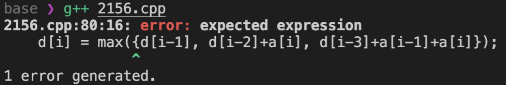

# C++ 17 컴파일 방법

- [C++ 17 컴파일 방법](#c-17-컴파일-방법)
  - [문제상황](#문제상황)
  - [컴파일 방법](#컴파일-방법)

## 문제상황



코딩 테스트 문제 풀이 시 C++17 문법을 사용했는데 컴파일이 되지 않는 경우가 종종 있다.

## 컴파일 방법

컴파일 시 `-std=c++17` 컴파일 옵션을 추가한다.

예시:

```bash
g++ 2156.cpp -std=c++17
```
