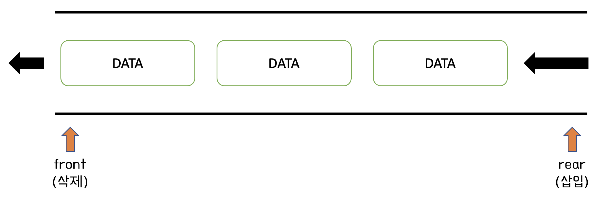
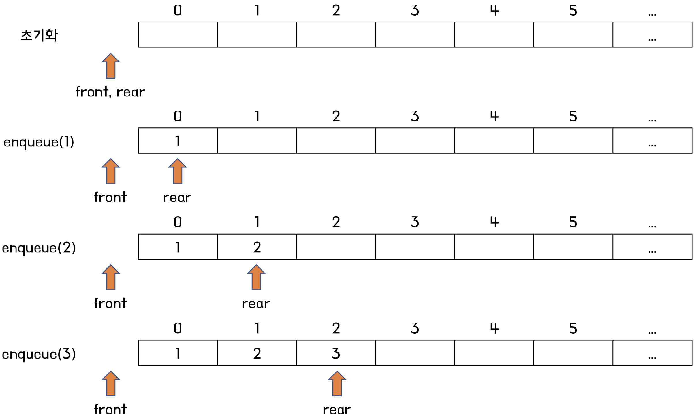
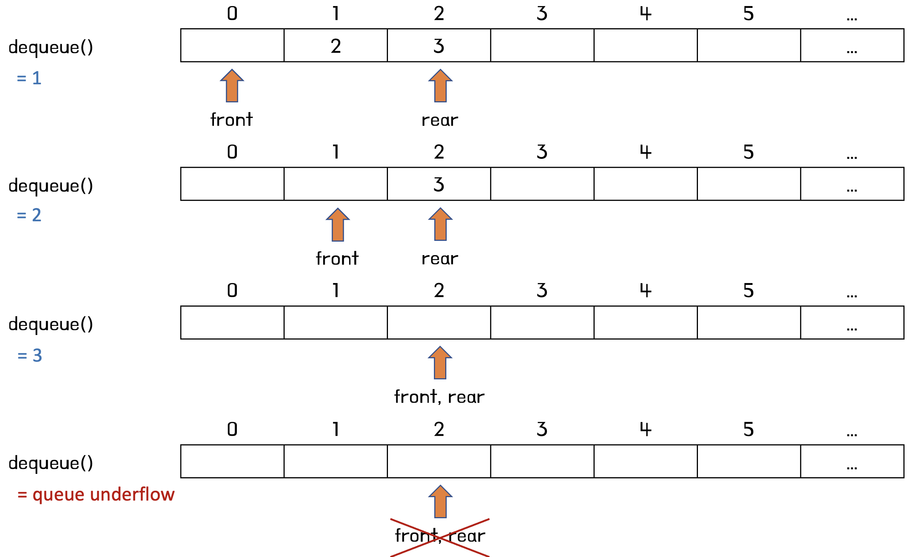
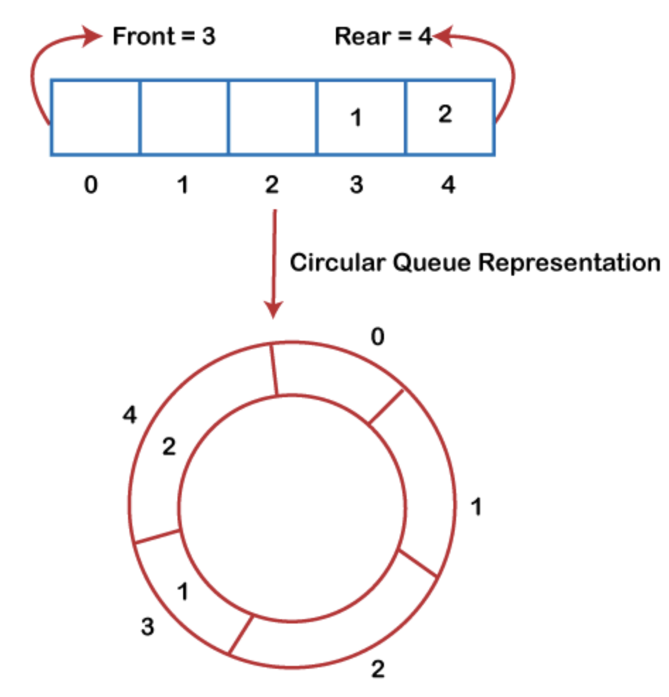
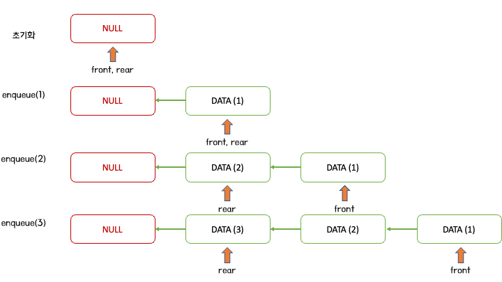
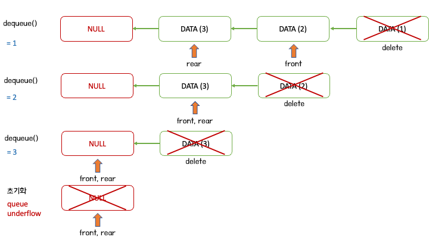

# 큐

- [큐](#큐)
  - [큐 란?](#큐-란)
  - [큐의 활용](#큐의-활용)
  - [큐 구현 (C++)](#큐-구현-c)
    - [배열을 이용한 큐 (1) - 선형 큐](#배열을-이용한-큐-1---선형-큐)
    - [배열을 이용한 큐 (2) - 원형 큐](#배열을-이용한-큐-2---원형-큐)
    - [연결 리스트를 이용한 큐](#연결-리스트를-이용한-큐)
  - [래퍼런스](#래퍼런스)

## 큐 란?



큐는 한쪽에서는 데이터의 삽입, 반대쪽에서 데이터의 추출이 발생하는 `선입선출(First-In First-Out, FIFO)` 특성의 자료구조이다.

큐에서 입력받는 위치를 `rear(뒤쪽)`, 삭제하는 위치를 `front(앞쪽)`라고 한다.

위 그림과 같이 `rear`로 들어온 데이터는 먼저 들어온 순서대로 `front`가 가리키게 되고, 따라서 먼저 들어온 데이터가 먼저 삭제된다.

일반적으로 큐는 다음과 같은 메소드를 제공한다.

- `enqueue(X)`: 원소 X를 `rear`에 입력한다.
- `dequeue()`: 큐의 `front`에서 값을 출력하고 삭제한다.
- `front()`: 큐의 `front`에 위치한 값을 출력한다.
- `isEmpty()`: 스택이 비어있는지 확인한다.
- `isFull()`: 스택이 꽉 찼는지 확인한다.
- `size()`: 스택의 현재 크기를 반환한다.

**주의**

- 스택과 마찬가지로, 큐가 비어있는데 `dequeue()` 메소드를 실행하면 `큐 언더플로우` 가 발생한다.
- 큐가 꽉 찼는데 `enqueue(X)` 메소드를 실행하면 `큐 오버플로우` 가 발생한다.

## 큐의 활용

큐는 먼저 들어온 데이터가 먼저 빠져나가는 FIFO 특징을 가지고 있다. 따라서 이를 활용할 수 있는 `대기열` 과 같은 기능들에 활용한다.

- CPU 스케줄링
- 게임 대기열 구현
- BFS (너비 우선 검색)
- 버퍼 입출력

## 큐 구현 (C++)

백준 [10845: 큐](https://www.acmicpc.net/problem/10845) 문제를 통해 큐 구현을 연습할 수 있다.

큐도 스택과 마찬가지로 배열을 이용하여 구현할 수 있고, 연결 리스트로 구현할 수 있다.

### 배열을 이용한 큐 (1) - 선형 큐

첫번째 구현 방법은 배열에서 `rear`와 `front`를 배열의 인덱스로 생각하고 구현하는 방법이다.

선형(Linear)으로 큐에 원소가 들어오면 `rear`를 다음 인덱스로 옮기면서 해당 위치에 원소를 삽입하고, 원소를 삭제하면 `front`를 다음 인덱스로 옮기면서 해당 위치의 원소를 삭제할 수 있다.




<details>
<summary>배열을 이용한 큐 (1) - 선형 큐 전체코드 (클릭)</summary>
<div markdown="1">

```c++
#include <iostream>
#include <stdexcept>

template <typename T> class LinearQueue {
    private:
    int QUEUE_SIZE = 100;   // 큐의 최대 크기
    T queue[100];           // 큐 배열
    int r = -1;             // 삽입할 위치
    int f = -1;             // 삭제할 위치

public:
    // 큐에 원소를 삽입
    void enqueue(T elem) {
        if (isFull()) {
            throw std::overflow_error("queue overflow");
        }
        queue[++r] = elem;
        return;
    }

    // 큐에서 원소를 제거
    T dequeue() {
        if (isEmpty()) {
            throw std::underflow_error("queue underflow");
        }
        return queue[++f];
    }

    // 큐의 front 위치의 원소를 반환
    T front() {
        if (isEmpty()) {
            throw std::underflow_error("queue underflow");
        }
        return queue[f+1];
    }

    // 큐가 비었는지 확인
    bool isEmpty() {
        return r == f;
    }

    // 큐가 가득 찼는지 확인
    bool isFull() {
        return r + 1 == QUEUE_SIZE;
    }

    // 큐에 들어간 원소의 개수를 반환
    int size() {
        return (r - f);
    }
};

int main(void) {
    LinearQueue<int> lq = LinearQueue<int>();

    lq.enqueue(1);
    std::cout << "size : " << lq.size() << "\n"; // size : 1
    lq.enqueue(2);
    std::cout << "size : " << lq.size() << "\n"; // size : 2
    lq.enqueue(3);
    std::cout << "size : " << lq.size() << "\n"; // size : 3

    std::cout << lq.dequeue() << "\n"; // 1
    std::cout << lq.dequeue() << "\n"; // 2
    std::cout << lq.dequeue() << "\n"; // 3
    std::cout << lq.dequeue() << "\n"; // queue underflow

    return 0;
}
```

</div>
</details>

---

**1. 클래스 구조**

```c++
template <typename T> class LinearQueue {
    private:
    int QUEUE_SIZE = 100;   // 큐의 최대 크기
    T queue[100];           // 큐 배열
    int r = -1;             // 삽입할 위치
    int f = -1;             // 삭제할 위치
```

큐에 들어갈 원소의 타입을 `T`로 설정하고, 내부적으로는 `T` 타입의 배열 `queue`를 이용하여 데이터를 저장하도록 정의한다.

배열을 선언해야 하므로 예시로 `QUEUE_SIZE`를 임의로 100으로 설정한다.

`r`와 `f` 는 각각 `queue` 배열의 `rear`와 `front` 를 나타내는 인덱스를 저장한다. 초기값은 -1로 설정한다.

- `r (rear)`: 마지막으로 원소가 삽입된 인덱스
- `f (front)`: 마지막으로 원소가 삭제된 인덱스

**2. enqueue**

```c++
// 큐에 원소를 삽입
void enqueue(T elem) {
    if (isFull()) {
        throw std::overflow_error("queue overflow");
    }
    queue[++r] = elem;
    return;
}
```

`enqueue` 메소드는 큐에 새로 원소를 삽입하는 메소드이다.

따라서 삽입 이전에 큐가 가득 찬 상태인지 확인한다. 만약 가득 찬 상태에 삽입을 시도할 경우 `큐 오버플로우` 에러를 발생한다.

인덱스 `r`는 `마지막으로 원소가 삽입된 인덱스`를 가리킨다.

따라서 새로운 원소는 `r+1` 인덱스에 저장되어야 하므로 `r`값을 1 증가시키고 해당 위치에 원소를 저장한다.

**3. dequeue**

```c++
// 큐에서 원소를 제거
T dequeue() {
    if (isEmpty()) {
        throw std::underflow_error("queue underflow");
    }
    return queue[++f];
}
```

`dequeue` 메소드는 큐에서 원소를 추출하고 제거하는 메소드이다.

`enqueue` 메소드와 반대로 큐가 비어있는 상태에서는 조회와 삭제가 불가능하므로 큐가 비어있는 상태인지 확인한다. 만약 큐가 비어있는 상태에서 삭제를 시도할 경우 `큐 언더플로우` 에러를 발생한다.

인덱스 `f`가 `마지막으로 원소가 삭제된 인덱스`이므로, 그 다음 위치인 `f+1`의 원소를 반환하면서 원소를 삭제한다.

**4. front**

```c++
// 큐의 front 위치의 원소를 반환
T front() {
    if (isEmpty()) {
        throw std::underflow_error("queue underflow");
    }
    return queue[f+1];
}
```

`front` 메소드는 `dequeue` 메소드와 비슷하지만, 원소를 삭제하지 않는다는 차이점이 있다.

따라서 큐가 빈 상태인지 확인한 후, `f+1` 위치의 원소를 반환한다.

**5. isEmpty**

```c++
// 큐가 비었는지 확인
bool isEmpty() {
    return r == f;
}
```

큐가 빈 상태인지 확인하는 `isEmpty` 메소드는 `r`과 `f` 값이 같은지 검사하는 것으로 구현할 수 있다.

처음 큐가 초기화되면 `r = f = -1` 로 빈 상태가 성립하고, 이후 `r`과 `f`가 변경되더라도 두 값이 같다면 `마지막으로 삽입된 위치와 마지막으로 삭제된 위치`가 동일하므로 큐에는 원소가 없음을 의미한다.

**6. isFull**

```c++
// 큐가 가득 찼는지 확인
bool isFull() {
    return r + 1 == QUEUE_SIZE;
}
```

큐가 가득 찬 상태인지 확인하는 `isFull` 메소드는 `r` 인덱스를 이용해 구현할 수 있다.

큐가 배열로 구성되었기 때문에, 배열은 인덱스가 0번부터 시작하므로 마지막으로 삽입할 수 있는 인덱스는 `QUEUE_SIZE-1`이다.

따라서 `r + 1 == QUEUE_SIZE`일 경우 큐가 가득 찬 것으로 판단한다.

```c++
// 큐에 들어간 원소의 개수를 반환
int size() {
    return (r - f);
}
```

마지막으로 큐에 들어간 원소의 개수는 `rear`와 `front`의 차이를 이용해 구할 수 있다.

### 배열을 이용한 큐 (2) - 원형 큐

앞서 설명한 배열을 이용한 선형 큐는 다음과 같은 특징을 가진다.

- 구현하기 쉽다.
- 연속적인 메모리를 사용한다.
- **메모리가 남아있어도 큐가 가득찬 것으로 판단할 수 있다.**

특히 마지막 특징때문에 배열을 이용한 선형 큐가 문제가 된다.

이전 구현에서 큐에 원소를 삽입하거나 삭제하면서 `rear`와 `front` 인덱스를 증가시키기만 했다.

따라서 적절히 삽입과 삭제를 반복하다보면 결국 `rear`가 `QUEUE_SIZE`에 가까워지게 되고, `dequeue` 메소드를 통해 앞의 원소를 삭제하여 `메모리가 남아있어도 큐가 가득 찬 것으로 판단` 한다.

선형 큐의 이런 문제점을 해결하기 위해 제시된 개념이 **원형 큐**이다.

원형 큐는 모듈러 연산을 통해 배열의 범위를 순회하면서 선형 큐의 문제점을 해결할 수 있다.

- 모듈러(나머지) 연산을 통해 인덱스가 배열의 끝을 지나면 배열의 처음으로 되돌린다.
- 기존 로직대로 사용할 경우 `isFull`과 `isEmpty`를 구분할 수 없으므로, `isFull` 계산 시 한 칸을 비운다. (즉, `rear`가 `front` 한칸 전에 있을때를 가득 찬 상태로 판단한다.)

 \*출처 : [[1]](https://www.javatpoint.com/circular-queue)

<details>
<summary>배열을 이용한 큐 (2) - 원형 큐 전체코드 (클릭)</summary>
<div markdown="1">

```c++
#include <iostream>
#include <stdexcept>

template <typename T> class CircularQueue {
    private:
    int QUEUE_SIZE = 100;   // 큐의 최대 크기
    T queue[100];           // 큐 배열
    int r = 0;              // 삽입할 위치
    int f = 0;              // 삭제할 위치

public:
    // 큐에 원소를 삽입
    void enqueue(T elem) {
        if (isFull()) {
            throw std::overflow_error("queue overflow");
        }
        r = (r + 1) % QUEUE_SIZE;
        queue[r] = elem;
        return;
    }

    // 큐에서 원소를 제거
    T dequeue() {
        if (isEmpty()) {
            throw std::underflow_error("queue underflow");
        }
        f = (f + 1) % QUEUE_SIZE;
        return queue[f];;
    }

    // 큐의 front 위치의 원소를 반환
    T front() {
        if (isEmpty()) {
            throw std::underflow_error("queue underflow");
        }
        int idx = (f + 1) % QUEUE_SIZE;
        return queue[idx];
    }

    // 큐가 비었는지 확인
    bool isEmpty() {
        return r == f;
    }

    // 큐가 가득 찼는지 확인
    bool isFull() {
        return (r + 1) % QUEUE_SIZE == f;
    }

    // 큐에 들어간 원소의 개수를 반환
    int size() {
        return (r - f + QUEUE_SIZE) % QUEUE_SIZE;
    }
};

int main(void) {
    CircularQueue<int> q = CircularQueue<int>();

    int i = 0;
    while (true)
    {
        q.enqueue(++i);
        std::cout << q.dequeue() << "\n";
    }

    return 0;
}
```

</div>
</details>

---

**1. 클래스 구조**

```c++
template <typename T> class CircularQueue {
    private:
    int QUEUE_SIZE = 100;   // 큐의 최대 크기
    T queue[100];           // 큐 배열
    int r = 0;              // 삽입할 위치
    int f = 0;              // 삭제할 위치
```

크게 달라진 부분은 없이 `rear`와 `front`를 `0` 부터 시작하도록 변경한다.

**2. enqueue**

```c++
// 큐에 원소를 삽입
void enqueue(T elem) {
    if (isFull()) {
        throw std::overflow_error("queue overflow");
    }
    r = (r + 1) % QUEUE_SIZE;
    queue[r] = elem;
    return;
}
```

`enqueue` 메소드는 `r+1` 위치로 이동하는 것을 모듈러 연산을 통해 인덱스가 순환할 수 있도록 변경한다.

**3. dequeue, front**

```c++
// 큐에서 원소를 제거
T dequeue() {
    if (isEmpty()) {
        throw std::underflow_error("queue underflow");
    }
    f = (f + 1) % QUEUE_SIZE;
    return queue[f];;
}

// 큐의 front 위치의 원소를 반환
T front() {
    if (isEmpty()) {
        throw std::underflow_error("queue underflow");
    }
    int idx = (f + 1) % QUEUE_SIZE;
    return queue[idx];
}
}
```

`dequeue`와 `front` 메소드도 마찬가지로 `f+1` 위치로의 이동 대신 모듈러 연산을 통해 인덱스를 순환하도록 변경한다.

**5. isEmpty**

```c++
// 큐가 비었는지 확인
bool isEmpty() {
    return r == f;
}
```

`isEmpty` 는 변경사항 없이 유지한다.

**6. isFull**

```c++
// 큐가 가득 찼는지 확인
bool isFull() {
    return (r + 1) % QUEUE_SIZE == f;
}
```

`isFull` 메소드는 기존 `rear`가 `QUEUE_SIZE`에 다가가면 큐가 가득찼다고 판단했다.

변경된 로직에서는 `rear`의 다음 위치에 `front`가 있다면 최대로 판단한다.

왜냐하면 `rear == front`라는 조건은 `isEmpty`의 조건과 중첩되어 한칸의 메모리를 손해보더라도 위와 같은 로직을 사용한다.

**7. size**

```c++
// 큐에 들어간 원소의 개수를 반환
int size() {
    return (r - f + QUEUE_SIZE) % QUEUE_SIZE;
}
```

`size` 메소드도 이제 `f > r` 과 같은 상황이 가능하므로 두 인덱스의 차이를 모듈러 연산을 통해 계산한다.

**8. 테스트**

```c++
int main(void) {
    CircularQueue<int> q = CircularQueue<int>();

    int i = 0;
    while (true)
    {
        q.enqueue(++i);
        std::cout << q.dequeue() << "\n";
    }

    return 0;
}
```

위 코드는 방금 구현한 원형 정수 큐에 `1` 부터 원소를 삽입하고, 바로 삭제한 후 `2, 3, 4, ...` 에 대해서 무한히 반복하는 코드이다.

기존 선형 큐는 `QUEUE_SIZE`가 100이지만 인덱스가 증가만 하기 때문에 삭제를 통해 메모리가 남아도 큐에 삽입이 되지 않고 `큐 오버플로우` 오류가 발생한다.

그러나 원형 큐로 구현한다면 `rear`와 `front` 인덱스가 순환하기 때문에 위 코드는 무한히 반복된다.

### 연결 리스트를 이용한 큐

배열을 이용한 원형 큐는 선형 큐의 메모리 문제를 해결했지만, 여전히 불필요한 메모리를 낭비한다. (`isEmpty`와 `isFull` 구분을 위해 사용)

또한 결국 `QUEUE_SIZE-1` 개의 원소만 수용할 수 있기 때문에 크기의 제약이 존재한다.

이를 해결할 수 있는 방법이 연결 리스트를 이용하여 큐를 구현하는 것이다.




<details>
<summary>연결 리스트 이용한 큐 (클릭)</summary>
<div markdown="1">

```c++
#include <iostream>
#include <stdexcept>

template <typename T> class Node {
    public:
        Node<T> *next;
        T data;
};

template <typename T> class ListQueue {
    private:
        Node<T> *r = NULL;      // rear
        Node<T> *f = NULL;      // front
        int queue_size = 0;     // 삽입된 원소의 수

    public:
    // 큐에 원소를 삽입
    void enqueue(T elem)
    {
        Node<T> *node = new Node<T>();
        node->data = elem;
        node->next = NULL;

        if (isEmpty()) {
            r = f = node;
        } else {
            r->next = node;
            r = node;
        }

        queue_size++;
        return;
    }

    // 큐에서 원소를 제거
    T dequeue() {
        if (isEmpty()) {
            throw std::underflow_error("queue underflow");
        }

        Node<T> *cur = f;
        Node<T> *nxt = f->next;
        T result = f->data;
        f = nxt;
        queue_size--;
        delete cur;

        return result;
    }

    // 큐의 front 위치의 원소를 반환
    T front() {
        if (isEmpty()) {
            throw std::underflow_error("queue underflow");
        }
        return f->data;
    }

    // 큐가 비었는지 확인
    bool isEmpty() {
        return queue_size == 0;
    }

    // 큐에 들어간 원소의 개수를 반환
    int size() {
        return queue_size;
    }
};

int main(void) {
    ListQueue<int> q = ListQueue<int>();

    int i = 0;
    while (true)
    {
        q.enqueue(++i);
        std::cout << q.size() << "\n";
    }

    return 0;
}
```

</div>
</details>

---

**1. 노드 클래스 정의**

```c++
template <typename T> class Node {
    public:
        Node<T> *next;
        T data;
};
```

**2. 큐 클래스 정의**

```c++
template <typename T> class ListQueue {
    private:
        Node<T> *r = NULL;      // rear
        Node<T> *f = NULL;      // front
        int queue_size = 0;     // 삽입된 원소의 수
```

`r`과 `f`는 각각 `가장 뒤에 있는 노드`와 `가장 앞에 있는 노드`를 가리키는 포인터이다.

`queue_size`는 큐의 현재 원소의 개수를 쉽게 파악하기 위해 추가한다.

연결 리스트를 위해 먼저 `Node` 클래스를 정의한다.

`Node`는 다음 노드의 포인터와 자신의 데이터를 저장한다.

**3. enqueue**

```c++
// 큐에 원소를 삽입
void enqueue(T elem)
{
    Node<T> *node = new Node<T>();
    node->data = elem;
    node->next = NULL;

    if (isEmpty()) {
        r = f = node;
    } else {
        r->next = node;
        r = node;
    }

    queue_size++;
    return;
}
```

`enqueue` 메소드는 연결 리스트로 구현한 큐에서는 최대 크기 제한이 없기 때문에 `isFull` 조건을 검사하지 않는다.

대신 빈 큐에 처음으로 새로운 노드를 삽입 할 경우 `rear`와 `front`를 모두 해당 원소를 저장하는 노드를 가리키게 한다.

이외의 경우에는 `rear`가 가장 뒤에 있는 노드를 가리키므로, 새로운 노드가 기존의 `rear`를 `next`로 가리키게 한 뒤, `rear` 포인터를 새로운 노드를 가리키게 한다.

**4. dequeue**

```c++
// 큐에서 원소를 제거
T dequeue() {
    if (isEmpty()) {
        throw std::underflow_error("queue underflow");
    }

    Node<T> *cur = f;
    Node<T> *nxt = f->next;
    T result = f->data;
    f = nxt;
    queue_size--;
    delete cur;

    return result;
}
```

`dequeue`는 큐가 비었을 때 `큐 언더플로우` 오류를 발생한다.

이외의 경우에는 현재 `front` 노드 포인터인 `cur`과 `cur`의 다음 노드 포인터인 `nxt`를 정의한다.

삭제는 간단하게 `f` 포인터를 `cur`에서 `nxt`로 변경하는 방식으로 구현할 수 있다.

이때 이전의 `front`이던 `cur`의 메모리를 할당 해제하기 위해 `delete cur;` 코드를 통해 메모리 낭비를 줄인다.

**5. front**

```c++
// 큐의 front 위치의 원소를 반환
T front() {
    if (isEmpty()) {
        throw std::underflow_error("queue underflow");
    }
    return f->data;
}
```

`front` 포인터가 가장 앞에 있는 노드를 가리키기 때문에 큐가 비지 않은 경우 `f`의 `data`를 반환한다.

**6. isEmpty**

```c++
// 큐가 비었는지 확인
bool isEmpty() {
    return queue_size == 0;
}
```

`r`과 `f`의 정의가 바뀌었기 때문에 간단하게 `queue_size` 변수를 통해 비었는지 확인하는 방식으로 변경한다.

**7. size**

```c++
// 큐에 들어간 원소의 개수를 반환
int size() {
    return queue_size;
}
```

`size`도 간단하게 멤버 변수인 `queue_size`를 반환하는 방식으로 변경한다.

**8. 테스트**

```c++
int main(void) {
    ListQueue<int> q = ListQueue<int>();

    int i = 0;
    while (true)
    {
        q.enqueue(++i);
        std::cout << q.size() << "\n";
    }

    return 0;
}
```

이전에는 큐의 크기가 정해졌기 때문에 입력과 삭제를 반복하는 테스트를 진행했다.

연결 리스트로 구현할 경우 메모리가 허락하는 내에서 크기 제한이 사라지므로 위 코드는 계속 반복한다.

## 래퍼런스

[1] https://www.javatpoint.com/circular-queue
