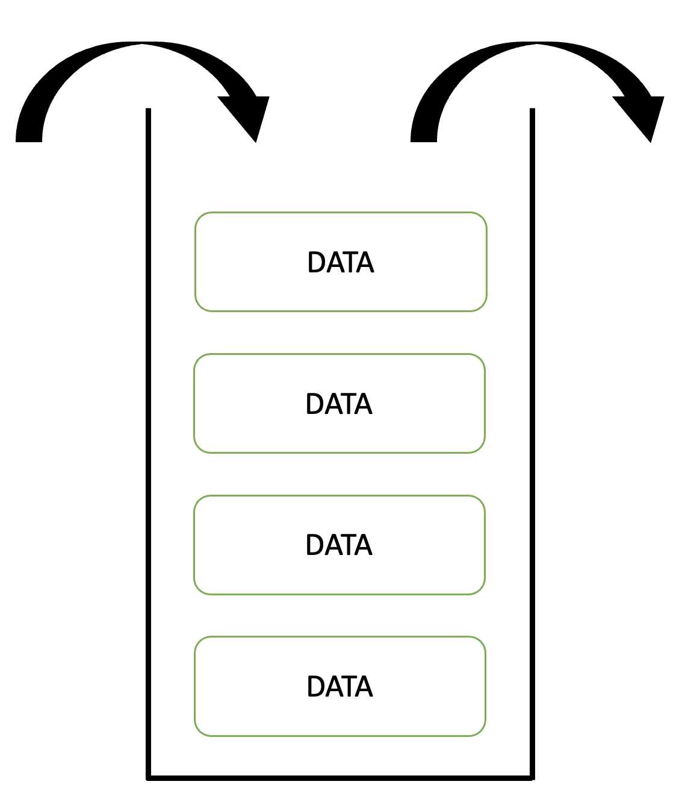
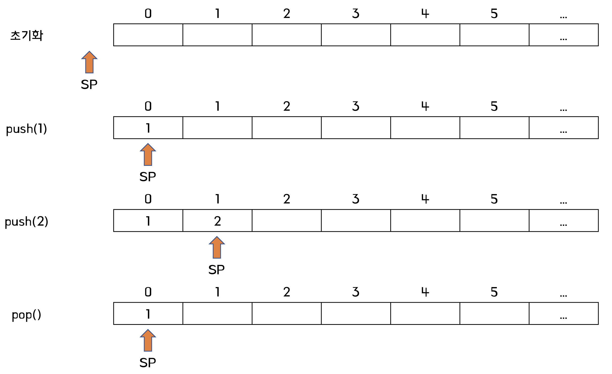
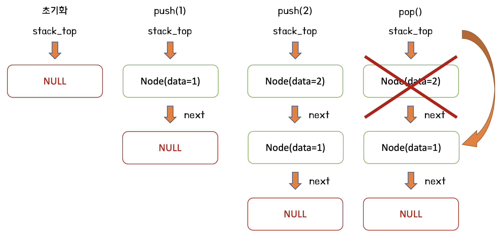

# 스택

- [스택](#스택)
  - [스택이란?](#스택이란)
  - [스택의 활용](#스택의-활용)
  - [스택 구현 (C++)](#스택-구현-c)
    - [배열을 이용한 스택](#배열을-이용한-스택)
    - [연결 리스트를 이용한 스택](#연결-리스트를-이용한-스택)
    - [배열 스택 vs 연결 리스트 스택](#배열-스택-vs-연결-리스트-스택)
  - [래퍼런스](#래퍼런스)

## 스택이란?



스택은 한쪽 방향에서만 입력과 출력이 가능한 자료구조로, `후입선출(Last-In First-Out, LIFO)` 특성의 자료구조이다.

위 그림과 같이 먼저 입력한 데이터는 가장 아래에 쌓이게 되며, 스택에서 데이터를 출력할 때에는 가장 마지막에 입력된 데이터부터 출력한다.

일반적으로 스택은 다음과 같은 메소드를 제공한다.

- `push(X)`: 원소 X를 입력한다.
- `pop()`: 스택에서 값을 출력 후 제거한다.
- `top()`: 스택에서 값을 출력한다.
- `isEmpty()`: 스택이 비어있는지 확인한다.
- `isFull()`: 스택이 꽉 찼는지 확인한다.
- `size()`: 스택의 현재 크기를 반환한다.

**주의**

- 스택이 비어있는데 `pop()` 메소드를 실행하면 `스택 언더플로우`가 발생한다.
- 스택이 꽉 찼는데 `push(X)` 메소드를 실행하면 `스택 오버플로우`가 발생한다.

## 스택의 활용

스택은 마지막에 입력한 데이터가 먼저 출력된다는 특성을 이용하여 여러 분야에서 활용할 수 있다.

- 스택 메모리
- 브라우저 뒤로가기
- DFS (깊이 우선 탐색)
- 후위표기식 변환

## 스택 구현 (C++)

스택 구현에 관심이 있다면 백준 [10828번: 스택](https://www.acmicpc.net/problem/10828) 문제를 풀어보면 도움이 된다.

여기서부터 몇가지 스택 구현 방식을 소개하려고 한다.

### 배열을 이용한 스택

먼저 기본적인 방법으로 배열을 이용한 스택 구현 방식이 있다.



<details>
<summary>배열 스택 전체코드 (클릭)</summary>
<div markdown="1">

```c++
#include <iostream>
#include <stdexcept>

template <typename T> class ArrayStack {
    private:
    int STACK_SIZE = 100;   // 스택의 최대 크기
    T stack[100];           // 스택 배열
    int sp = -1;            // 스택 포인터

    public:
    // 스택에 원소를 삽입
    void push(T elem) {
        if (isFull()) {
            throw std::overflow_error("stack overflow");
        }
        stack[++sp] = elem;
        return;
    }

    // 스택에서 원소를 제거
    T pop() {
        if (isEmpty()) {
            throw std::underflow_error("stack underflow");
        }
        return stack[sp--];
    }

    // 스택에서 원소를 제거하지 않고 출력
    T top() {
        if (isEmpty()) {
            throw std::underflow_error("stack underflow");
        }
        return stack[sp];
    }

    // 스택이 비었는지 확인
    bool isEmpty() {
        return sp == -1;
    }

    // 스택이 가득 찼는지 확인
    bool isFull() {
        return sp == STACK_SIZE - 1;
    }

    // 스택에 들어간 원소의 개수를 반환
    int size() {
        return sp + 1;
    }
};

int main(void) {
    ArrayStack<int> stack = ArrayStack<int>();

    stack.push(1);
    std::cout << stack.top() << "\n"; // 1

    stack.push(2);
    std::cout << stack.top() << "\n"; // 2

    stack.push(3);
    std::cout << stack.top() << "\n"; // 3

    stack.pop();
    std::cout << stack.top() << "\n"; // 2

    stack.pop();
    std::cout << stack.top() << "\n"; // 1

    // 원소가 없는데 출력함. stack underflow
    stack.pop();
    std::cout << stack.top() << "\n";

    return 0;
}
```

</div>
</details>

---

**1. 클래스 정의**

```c++
template <typename T> class ArrayStack {
    private:
    int STACK_SIZE = 100;   // 스택의 최대 크기
    T stack[100];           // 스택 배열
    int sp = -1;            // 스택 포인터
```

먼저 스택의 원소로 정수나 문자열 등 여러가지 타입이 입력될 수 있으므로, 제네릭 클래스처럼 `Template class`로 정의한다.

`STACK_SIZE`는 스택의 최대 크기이다.

`stack`은 `T` 타입으로, 크기가 `STACK_SIZE`인 배열이다. 실제 원소의 저장을 담당한다.

`sp`는 스택 포인터의 줄임말로, **마지막으로 입력한 원소의 인덱스**를 나타낸다.

**2. push**

```c++
// 스택에 원소를 삽입
void push(T elem) {
    if (isFull()) {
        throw std::overflow_error("stack overflow");
    }
    stack[++sp] = elem;
    return;
}
```

스택에 원소를 삽입하는 메소드인 `push` 메소드는 먼저 스택이 가득 차 있는 상태인지 확인해야 한다.

만약 스택이 가득 찬 상태에서 새로운 원소를 삽입할 경우 스택 오버플로우 오류가 발생한다.

이외의 경우에는 `sp`가 마지막으로 원소가 삽입되었던 인덱스이므로, `sp+1` 위치에 입력받은 원소 `elem`을 삽입한다.

**3. pop**

```c++
// 스택에서 원소를 제거
T pop() {
    if (isEmpty()) {
        throw std::underflow_error("stack underflow");
    }
    return stack[sp--];
}
```

스택에서 원소를 제거하고, 그 원소를 반환하는 메소드인 `pop` 메소드는 `push`와 반대로 스택이 비어있는 상태인지 확인해야 한다.

만약 스택이 빈 상태에서 원소를 제거하려고 하면 스택 언더플로우 오류가 발생한다.

이외의 경우에는 마지막으로 원소가 삽입되었던 위치인 `sp` 인덱스의 원소를 반환하고, `sp`값을 `sp-1` 로 저장한다.

**4. top**

```c++
// 스택에서 원소를 제거하지 않고 출력
T top() {
    if (isEmpty()) {
        throw std::underflow_error("stack underflow");
    }
    return stack[sp];
}
```

`top` 메소드는 `pop` 메소드에서 원소를 제거하는 로직만 제외하면 된다.

따라서 `sp` 값을 변경하지 않도록 구현하고, 이외에는 `pop` 메소드와 동일하다.

**5. isEmpty**

```c++
// 스택이 비었는지 확인
bool isEmpty() {
    return sp == -1;
}
```

스택이 비었는지 확인하는 `isEmpty` 메소드는 스택 포인터가 이동하지 않았는지 비교한다.

스택 포인터의 초기값이 `-1` 이므로, `sp`가 `-1`이라면 `true`, 그렇지 않다면 `false`를 반환한다.

**6. isFull**

```c++
// 스택이 가득 찼는지 확인
bool isFull() {
    return sp == STACK_SIZE - 1;
}
```

스택이 가득 찼는지 확인하는 `isFull` 메소드는 스택 포인터가 스택 배열의 마지막 원소에 위치했는지 확인한다.

배열의 인덱스를 0부터 사용하면 배열의 최대 인덱스는 `STACK_SIZE-1`이다. 따라서 `sp`가 `STACK_SIZE-1` 이라면 `true`, 그렇지 않다면 `false`를 반환한다.

**7. size**

```c++
// 스택에 들어간 원소의 개수를 반환
int size() {
    return sp + 1;
}
```

마지막으로 스택에 들어있는 원소의 개수를 반환하는 `size` 메소드는 스택 포인터를 이용하여 계산할 수 있다.

스택 포인터는 마지막에 입력한 원소가 있는 인덱스를 나타내므로, 배열의 인덱스가 0부터 시작하는 것을 감안하여 `sp+1` 값을 반환한다.

### 연결 리스트를 이용한 스택

앞서 살펴본 배열을 이용한 스택은 클래스 내부에서 배열을 선언하고, 그 배열에 데이터를 저장하기 때문에 스택의 크기가 정해진다는 제한이 있다.

이를 해결하기 위한 방법 중 하나로, 배열을 사용하는 대신 연결 리스트를 이용하여 스택을 구현하는 방법이 있다.



<details>
<summary>리스트 스택 전체코드 (클릭)</summary>
<div markdown="1">

```c++
#include <iostream>
#include <stdexcept>

template <typename T> class Node {
    public:
        Node<T> *next;
        T data;
};

template <typename T> class ListStack {
    private:
        Node<T> *stack_top = NULL;
        int stack_size = 0;

    public:
    // 스택에 원소를 삽입
    void push(T elem) {
        // 새로운 노드 연결
        Node<T> *node = new Node<T>();
        node->next = stack_top;
        node->data = elem;

        // 스택 갱신
        stack_top = node;
        stack_size++;

        return;
    }

    // 스택에서 원소를 제거
    T pop() {
        if (isEmpty()) {
            throw std::underflow_error("stack underflow");
        }

        T data = stack_top->data;
        stack_top = stack_top->next;
        stack_size--;

        return data;
    }

    // 스택에서 원소를 제거하지 않고 출력
    T top() {
        if (isEmpty()) {
            throw std::underflow_error("stack underflow");
        }

        return stack_top->data;
    }

    // 스택이 비었는지 확인
    bool isEmpty() {
        return stack_top == NULL;
    }

    // 스택에 들어간 원소의 개수를 반환
    int size() {
        return stack_size;
    }
};

int main(void)
{
    ListStack<int> stack = ListStack<int>();

    stack.push(100);
    std::cout << stack.top() << "\n"; // 1

    stack.push(200);
    std::cout << stack.top() << "\n"; // 2

    stack.push(300);
    std::cout << stack.top() << "\n"; // 3

    stack.pop();
    std::cout << stack.top() << "\n"; // 2

    stack.pop();
    std::cout << stack.top() << "\n"; // 1

    // 원소가 없는데 출력함. stack underflow
    stack.pop();
    std::cout << stack.top() << "\n";

    // 원소가 없는데 출력함. stack underflow
    stack.pop();
    std::cout << stack.top() << "\n";

    return 0;
}
}
```

</div>
</details>

---

**1. 노드 클래스 정의**

```c++
template <typename T> class Node {
    public:
        Node<T> *next;
        T data;
};
```

연결 리스트를 위해 먼저 `Node` 클래스를 정의한다.

`Node`는 다음 노드의 포인터와 자신의 데이터를 저장한다.

**2. 스택 클래스 정의**

```c++
template <typename T> class ListStack {
    private:
        Node<T> *stack_top = NULL;
        int stack_size = 0;
```

배열 스택과 마찬가지로 `Template class`로 정의한다.

`stack_top`은 가장 마지막에 입력한 원소를 저장한 노드를 가리키는 포인터이다.

`stack_size`는 현재 스택에 들어있는 원소의 개수를 나타낸다.

**3. push**

```c++
// 스택에 원소를 삽입
void push(T elem) {
    // 새로운 노드 연결
    Node<T> *node = new Node<T>();
    node->next = stack_top;
    node->data = elem;

    // 스택 갱신
    stack_top = node;
    stack_size++;

    return;
}
```

`push` 메소드는 입력받은 원소를 가진 노드를 생성하여 `stack_top`이 해당 노드를 가리키게 만드는 메소드이다.

`push` 메소드가 끝나도 메모리에 해당 값이 유지되도록 `new` 키워드를 통해 노드를 생성한다.

생성한 노드가 `next`로 기존 `stack_top`을 가리키고 `data`로 입력할 원소를 가지도록 설정한다.

이후 `stack_top`을 방금 설정한 노드를 가리키게 하고 개수를 증가시킨다.

여기서 배열 스택과 다른 점은 `isFull` 메소드를 통한 스택 오버플로우 검사를 하지 않는다는 점이다. 왜냐하면 연결 리스트를 이용하기 때문에 스택의 최대 크기 제한 조건이 없어졌기 때문이다.

**4. pop**

```c++
// 스택에서 원소를 제거
T pop() {
    if (isEmpty()) {
        throw std::underflow_error("stack underflow");
    }

    T data = stack_top->data;
    stack_top = stack_top->next;
    stack_size--;

    return data;
}
```

`pop` 메소드는 `stack_top` 포인터를 이용하여 처리한다.

스택에서 꺼낼 값은 `stack_top`의 `data`에서 가져오고, 원소의 제거는 `stack_top`을 다음 노드를 가리키도록 변경하면 된다.

이후 성공적으로 제거되었으면 스택의 원소 수를 줄인다.

`push` 메소드와 다르게 `pop` 메소드는 `isEmpty` 를 통해 여전히 스택 언더플로우 조건을 처리한다.

**5. top**

```c++
// 스택에서 원소를 제거하지 않고 출력
T top() {
    if (isEmpty()) {
        throw std::underflow_error("stack underflow");
    }

    return stack_top->data;
}
```

배열 스택과 마찬가지로 `top` 메소드는 `pop` 메소드에서 원소를 제거하는 로직만 제외하여 구현할 수 있다.

**6. isEmpty**

```c++
// 스택이 비었는지 확인
bool isEmpty() {
    return stack_top == NULL;
}
```

`isEmpty` 메소드는 `stack_top`이 초기값인 `NULL`인지 검사한다.

**7. size**

```c++
// 스택에 들어간 원소의 개수를 반환
int size() {
    return stack_size;
}
```

마지막으로 `size` 메소드는 기존에 정의한 `stack_size` 멤버 변수를 이용하여 간단하게 원소의 수를 반환할 수 있다.

### 배열 스택 vs 연결 리스트 스택

두개의 구현방식의 차이는 배열과 연결 리스트의 차이와 비슷하다.

배열은 크기가 정해져있는 대신 연속적인 메모리를 할당하므로 메모리 관리가 편하다.

반대로 연결 리스트는 동적으로 할당하기 때문에 크기 제한은 없지만, 그만큼 메모리 관리가 어렵다.

## 래퍼런스

https://www.techiedelight.com/stack-implementation-using-linked-list/
