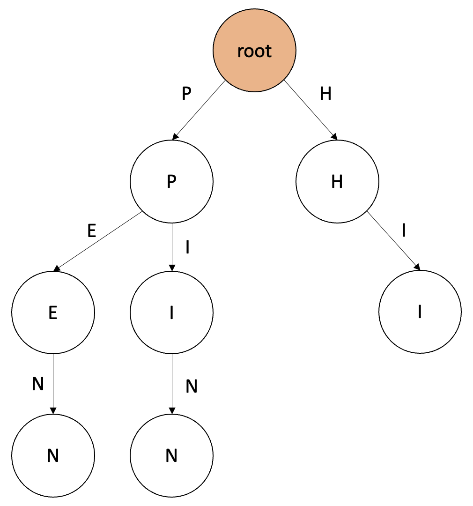

# Trie 자료구조

> 문자열을 효율적으로 검색할 수 있는 자료구조인 Trie 자료구조에 대해 간단히 알아보자.

## 왜 필요할까?

이진 탐색 트리와 같이 N개의 원소 중에서 우리가 원하는 원소를 탐색하는 시간은 일반적으로 O(log n) 시간복잡도를 가진다. 그러나 만약 원소의 타입이 문자열이라면, 문자열을 비교하기 위해서 문자열의 길이(m) 만큼 추가로 시간이 걸리게 된다. 즉, O(m log n) 시간복잡도를 가진다. 

따라서 문자열을 빠르게 검색하기 위해서는 새로운 방법이 필요했고, 그래서 고안된 자료구조가 바로 트라이(Trie) 이다.

## 트라이(Trie) 란?



```Prefix-tree, Digital-tree, Retrival-tree``` 등으로도 불리는 자료구조로, 앞서 말한대로 **문자열을 빠르게 검색하고, 관리하기 좋은 자료구조**로, **문자열의 집합을 표현하는 트리 자료구조**의 일종이다.

위의 예시에서는 트라이 자료구조에 “PEN”, “PIN”, “HI” 라는 문자열 집합을 입력한 경우를 보여주는 예시이다. 가장 위의 root 노드는 항상 길이가 0인 문자열에 대응된다. 이후 root 노드 아래에 자식 노드로 이어나가면서 트라이 자료구조를 확장할 수 있다.

## 구성

- 트라이 자료구조의 확장은 접두사(Prefix)가 연결된 문자열들이 부모-자식 관계를 맺으면서 확장한다.
- 종료 노드를 설정하여 해당 문자열까지가 집합에 포함되어 있다는 것을 나타내야 한다. (위의 예시에서 'N', 'N', 'I' 문자가 해당한다.)
    - 예를 들어 위의 예시에서 종료 노드를 표시하지 않으면 트라이 자료구조 내에 “PEN”, “PE”, “P” 등 여러 문자열이 집합에 포함될 수 있다.
    - 따라서 우리가 원하는 “PEN”, “PIN”, “HI” 라는 문자열들만 종료 노드임을 나타내주어야 한다.
- 트라이의 각 노드는 다음을 저장한다.
    - **해당 노드가 종료 노드인지를 나타내는 변수**
    - **자식 노드를 나타내는 포인터 목록**

## 특징

1. 탐색의 시간 복잡도는 O(m) 이다.
2. 자식 노드를 탐색하는 시간을 줄이기 위해서 자식 노드를 나타내는 포인터 배열이나 해시맵을 사용한다. (따라서 공간복잡도가 굉장히 크다.)
3. 루트 노드에서 어떤 노드까지 내려왔을 때, 만나는 글자들을 모두 모으면 검색하고 있는 노드의 접두사(Prefix)를 얻을 수 있다.

## 구현

방법은 여러가지가 있겠지만, 간단한 구현 예시를 살펴보자.

```cpp
#include <bits/stdc++.h>
using namespace std;

class Trie {
    private:
        // 알파벳을 정수로 변환한다. children 배열의 인덱스에 접근하도록 한다.
        int toInteger(char alphabet) {
            return alphabet - 'a';
        }

    public:
        bool isTerminal;    // 단말 노드인지를 저장한다.
        Trie* children[26]; // 자식 노드로 a~z 가 있다면 포인터를 저장한다.

        Trie() {
            this->isTerminal = false;
            for (int i=0; i<26; i++) {
                this->children[i] = NULL;
            }
        }

        // 트라이에 str 문자열을 입력한다.
        // 재귀적으로 트라이에서 문자 각각을 탐색하여, 만약 해당 문자가 없다면 새로운 노드를 추가하여 이어간다.
        void insert(const string str) {
            Trie* cursor = this;
            for (char element : str) {
                if (!cursor->children[toInteger(element)]) {
                    cursor->children[toInteger(element)] = new Trie();
                }
                cursor = cursor->children[toInteger(element)];
            }
            cursor->isTerminal = true; // 문자가 추가되었으므로 종료 노드로 설정한다.
        }

        // 트라이에서 str 문자열이 존재하는지 확인한다.
        // 트라이의 Root 에서 문자 각각을 탐색하므로 시간복잡도는 O(m) 이다.
        bool find(const string str) {
            bool result = true;
            Trie* cursor = this;
            for (char element : str) {
                if (!cursor->children[toInteger(element)]) {
                    result = false;
                    break;
                }
                cursor = cursor->children[toInteger(element)];
            }
            return result;
        }
};
```

## 사용처

트라이 자료구조는 STL 등으로 따로 제공되지는 않지만, 여러번 사용하다보면 생각보다 구현하기 어렵지 않다.

특히 카카오 코딩테스트에서 종종 필요한 것으로 유명한데, 대표적인 문제가 2020 카카오 코딩테스트 문제 중 가사 검색(https://programmers.co.kr/learn/courses/30/lessons/60060?language=cpp) 문제이다.

해당 문제의 경우 Map 자료구조 등으로 문자열을 비교하면 정확도 테스트는 통과할 수 있지만, 효율성 테스트는 통과할 수 없다. 이런 상황에서 사용할 수 있는 자료구조가 트라이이므로, 코딩테스트에 관심이 있다면 꼭 한번 연습하길 추천한다.

### 추천문제 (BOJ)

- [14425-문자열 집합](https://www.acmicpc.net/problem/14425)
- [20166-문자열 지옥에 빠진 호석](https://www.acmicpc.net/problem/20166)
- [5052-전화번호 목록](https://www.acmicpc.net/problem/5052)
- [14725-개미굴](https://www.acmicpc.net/problem/14725)