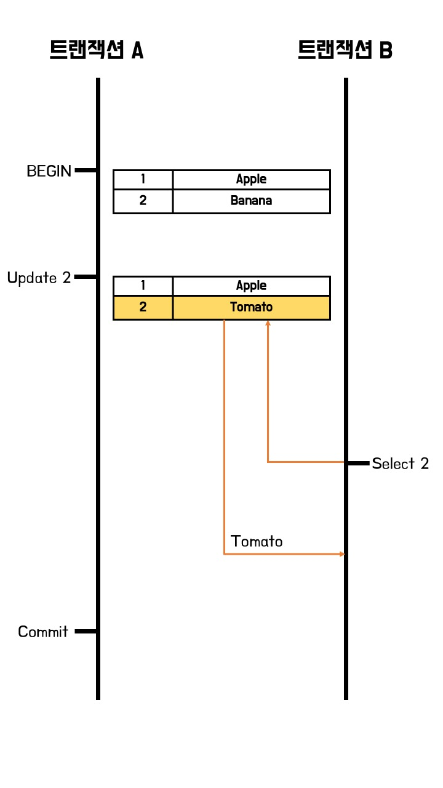
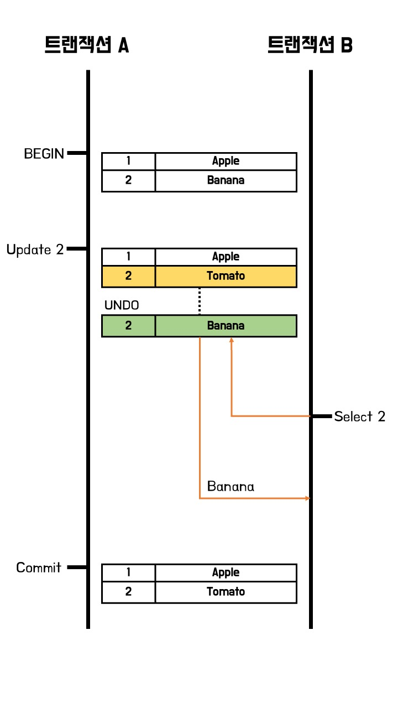
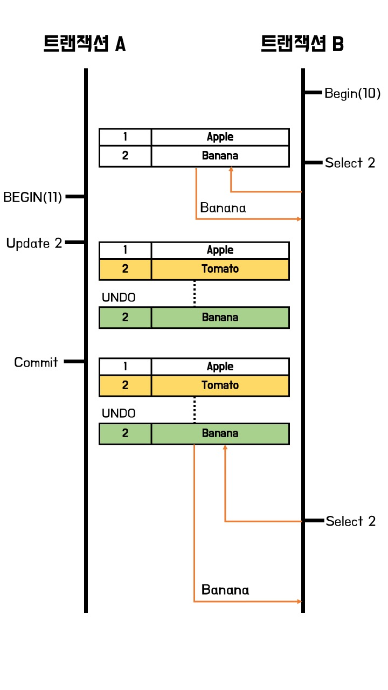
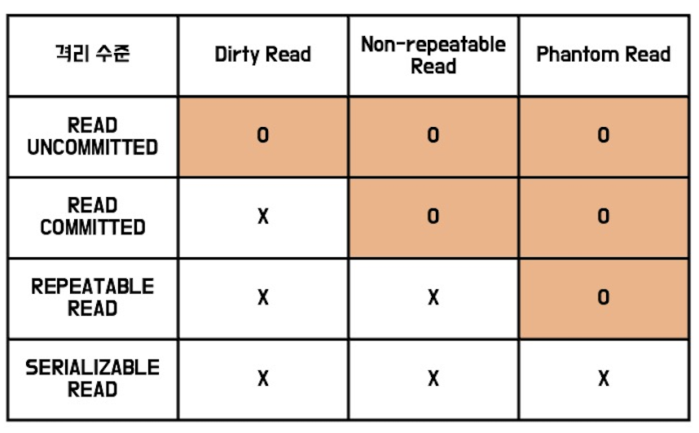

# 트랜잭션이란?

- [트랜잭션이란?](#트랜잭션이란)
  - [트랜잭션의 정의](#트랜잭션의-정의)
  - [트랜잭션의 특징](#트랜잭션의-특징)
    - [Atomicity (원자성)](#atomicity-원자성)
    - [Constency (일관성)](#constency-일관성)
    - [Isolation (격리성)](#isolation-격리성)
    - [Durability (영속성)](#durability-영속성)
  - [트랜잭션 격리 수준 (Transaction-isolation-level)](#트랜잭션-격리-수준-transaction-isolation-level)
    - [READ UNCOMMITTED (Level 0)](#read-uncommitted-level-0)
    - [READ COMMITTED (Level 1)](#read-committed-level-1)
    - [REPEATABLE READ (Level 2)](#repeatable-read-level-2)
    - [SERIALIZABLE READ](#serializable-read)
    - [격리 수준 별 동시성 문제](#격리-수준-별-동시성-문제)
  - [래퍼런스](#래퍼런스)

## 트랜잭션의 정의

> 데이터베이스의 상태를 변화시키는 기능을 수행하기 위한 작업수행의 논리적 단위

데이터베이스에 접근하여 상태를 변화시키기 위해서 우리는 질의(Query)를 처리하게 한다.

만약 어떠한 논리적 작업(ex: 송금, 출금 등)을 하기 위해서는 하나의 질의만으로는 작업을 처리할 수 없고, 여러개의 질의를 사용하여 논리적 작업을 처리한다.

이러한 논리적 작업을 하기 위해 질의를 모아놓은 것이 바로 트랜잭션이다.

(참고로 DBMS는 이러한 트랜잭션을 기반으로 처리하기 때문에, DBMS의 성능을 측정할 때 TPS(Transaction Per Second), 초당 트랜잭션 처리 수를 사용하기도 한다.)

## 트랜잭션의 특징

트랜잭션은 하나의 논리적 단위로 정의되어 있다. 즉, 실제 질의는 여러개지만 논리적으로 하나의 작업만 수행한다고 정의한 것이다.

따라서 트랜잭션의 가장 큰 특징은 오류 없이 작업을 마치면 변경 내역을 저장하는 커밋(Commit)을 진행하고, 만약 트랜잭션 도중 오류가 발생한다면 변경 내용을 되돌리는 롤백(Rollback)을 실행하는 것이다.

이러한 트랜잭션의 특징을 만족하기 위한 트랜잭션의 4가지 특성을 **ACID** 라고 한다.

### Atomicity (원자성)

- 트랜잭션의 작업은 부분적으로 실행되거나 중간에 중단되지 않는다.
- 트랜잭션은 가장 작은 작업 수행의 단위이므로 `"All or Nothing"`의 특성을 가진다.

### Constency (일관성)

- 트랜잭션이 성공적으로 작업을 마치면 데이터베이스의 상태는 일관적으로 유지된다.
- 시스템이 가지고 있는 요소는 트랜잭션 전 후로 변하지 않는다.
  (`price`라는 컬럼의 타입이 `integer`에서 트랜잭션 이후 `string` 등으로 변하지 않는 것을 의미한다.)

### Isolation (격리성)

- 트랜잭션 처리 중 다른 트랜잭션이 중간에 개입할 수 없다.
- 트랜잭션이 수행중이라면 다른 트랜잭션에서 수행 결과를 참조할 수 없다.

### Durability (영속성)

- 트랜잭션이 작업을 성공적으로 마치면, 그 결과는 데이터베이스에 계속 반영된다.
- 즉 커밋된 정보는 데이터베이스에 저장된다는 것을 의미한다.

## 트랜잭션 격리 수준 (Transaction-isolation-level)

트랜잭션 여러개가 동시에 일어날 경우 트랜잭션 작업에 사용중인 데이터를 읽는 상황과 같은 때에 `Dirty Read`와 같은 문제가 발생할 수 있다.

`트랜잭션 격리 수준`이란 이러한 상황에서 트랜잭션중인 데이터를 다른 트랜잭션에서 변경하거나 조회할 수 있을지 결정한 것을 의미한다.

다음과 같은 총 4가지 트랜잭션 격리 수준이 있다. (위에서부터 느슨한 수준으로, 아래로 갈 수록 엄격한 수준을 가진다.)

- `READ UNCOMMITTED`
- `READ COMMITTED`
- `REPEATABLE READ`
- `SERIALIZABLE`

하나씩 살펴보자.

### READ UNCOMMITTED (Level 0)

가장 느슨한 격리 수준으로, 커밋 혹은 롤백 여부와 상관 없이 다른 트랜잭션에서 데이터를 읽어올 수 있다.

위 예시와 같이 트랜잭션 A가 과일 테이블에 접근하여 작업을 수행중인 상황에서, 트랜잭션 B는 작업중인 과일 테이블에서 데이터를 읽어올 수 있다.

이러한 방식의 문제점은 무엇일까?

- `Dirty Read` 문제가 발생한다.

**Dirty Read**

1. 위 예시에서 만약 트랜잭션 A의 `UPDATE` 이전에 트랜잭션 B가 인덱스 2의 데이터를 읽는다면?
   - 트랜잭션 A가 성공적으로 수행된다면 트랜잭션 A가 알고 있는 인덱스 2는 Tomato이고, 트랜잭션 B가 알고 있는 인덱스 2는 Banana 일 것이다.
2. 만약 위 예시에서 트랜잭션 A가 `INSERT`를 진행하고 롤백한다면?
   - 트랜잭션 A에서 삽입한 데이터를 트랜잭션 B가 읽어온 뒤, 트랜잭션 A에서 오류가 발생해 롤백을 진행하면 트랜잭션 B는 결과적으로 없는 데이터를 읽는 상황이 된다.

### READ COMMITTED (Level 1)

대부분의 관계형 데이터베이스(Oracle 등)에서 사용하는 격리 수준으로, 다른 트랜잭션은 커밋 된 데이터만 읽어올 수 있도록 제한한다.

트랜잭션 진행 간에 트랜잭션 실패 시 UNDO 할 데이터를 백업해둔다. 즉 마지막으로 커밋된 데이터를 UNDO 영역에 저장해둔다.

트랜잭션 수행 간 다른 트랜잭션이 해당 테이블의 데이터를 조회하려고 하면, 앞서 소개한 UNDO 영역에서 커밋된 데이터를 읽어온다.

- `READ COMMITTED`는 `Dirty Read` 문제를 해결할 수 있다.
- `Non-Repeatable Read(Inconsistent Analysis)` 문제가 발생한다.

**Non-Repeatable Read**

1. 트랜잭션 A가 커밋되기 이전에 트랜잭션 B가 인덱스 2를 조회하면 그 결과는 `Banana`이다.
2. 트랜잭션 A가 커밋 된 이후에 트랜잭션 B가 인덱스 2를 조회하면 그 결과는 `Tomato`이다.
3. 즉 한 트랜잭션 내에서 같은 질의를 했을 때 서로 다른 결과가 나오는 문제가 발생한다.

### REPEATABLE READ (Level 2)

`MySQL`의 `InnoDB` 엔진의 기본 격리 수준으로, 트랜잭션이 시작 될 때 마다 트랜잭션 번호를 부여하고, 그 트랜잭션 번호보다 낮은 트랜잭션 번호에서 변경된 것만 읽도록 하는 격리 수준이다.

**과정**

1. 트랜잭션 B가 먼저 시작되어 트랜잭션 번호 10번을 부여받는다.
2. 이때 트랜잭션 B가 테이블에서 인덱스 2번을 조회하면 그 결과는 `Banana`이다.
3. 다음으로 트랜잭션 A가 시작되어 트랜잭션 번호 11번을 부여받는다.
4. 트랜잭션 A는 테이블의 인덱스 2번을 `UPDATE` 질의를 통해 변경한다.
5. 트랜잭션 A가 종료되고, 트랜잭션 B가 다시 테이블에서 인덱스 2번을 조회한다.
6. 트랜잭션 A의 트랜잭션 번호는 11으로, 트랜잭션 B의 번호보다 크기때문에 그 이전의 테이블 데이터인 `Banana`를 동일하게 조회할 수 있다.

- `Non-Repeatable Read(Inconsistent Analysis)` 문제를 해결할 수 있다.
- `Phantom Read` 문제가 발생한다.

**Phantom Read**

> 참고: 동일한 트랜잭션에서 동일한 범위의 레코드를 여러번 조회할 때 처음 조회에서 보이지 않던 레코드가 두번째 조회(이후 조회)에서는 보이기 때문에 유령 레코드라고 한다.

1. 위의 예시처럼 트랜잭션 B가 먼저 시작하고, 다음으로 트랜잭션 A가 시작된다.
2. 트랜잭션 A에서 `SELECT COUNT ...`와 같은 쿼리로 과일 종류 수를 집계하여 조회한다.
3. 이후 트랜잭션 B에서 새로운 과일을 `INSERT` 한 후 `COMMIT`한다. (이 경우, 트랜잭션 B의 트랜잭션 번호가 트랜잭션 A보다 낮으므로 트랜잭션 A는 커밋된 데이터를 조회할 수 있다.)
4. 다시한번 트랜잭션 A에서 `SELECT COUNT ...`와 같은 쿼리로 과일 종류 수를 집계하면 `3번`에서 삽입한 데이터때문에 다른 결과가 나온다.

### SERIALIZABLE READ

먼저 시작한 트랜잭션이 사용중인 데이터를 늦게 시작한 트랜잭션이 `삽입, 갱신, 삭제` 모두 불가능하도록 한다.

가장 단순하면서도 엄격한 격리 수준으로, 완벽한 읽기 일관성을 제공한다.

그러나 성능적으로 동시 처리가 매우 좋지 않으므로 데이터베이스에서 잘 사용하지 않는다.

### 격리 수준 별 동시성 문제

위와 같이 데이터베이스도 OS와 같이 동시성 문제가 발생하고, 격리 수준에 따라 해결할 수 있는 동시성 문제가 다름을 잊지 말자.

## 래퍼런스

[널널한 개발자 TV](https://www.youtube.com/watch?v=7yuGlqPo8XQ) 유튜브

[victolee](https://victorydntmd.tistory.com/129)님 블로그

[Nesoy](https://nesoy.github.io/articles/2019-05/Database-Transaction-isolation)님 블로그

https://private-space.tistory.com/97

http://wiki.gurubee.net/pages/viewpage.action?pageId=21200923
