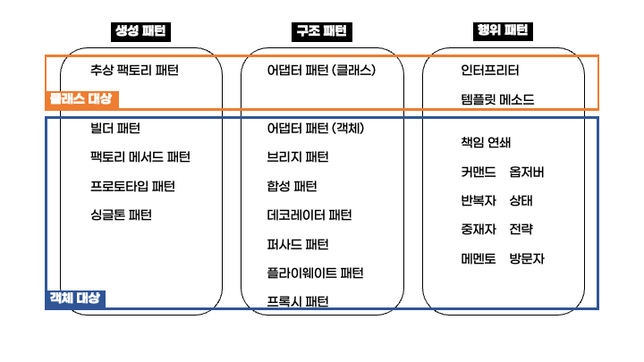

# GoF(Gang of Four) 디자인 패턴

- [GoF(Gang of Four) 디자인 패턴](#gofgang-of-four-디자인-패턴)
  - [GoF?](#gof)
  - [GoF 디자인 패턴 목록](#gof-디자인-패턴-목록)
  - [행위 패턴](#행위-패턴)
  - [구조 패턴](#구조-패턴)
  - [행위 패턴](#행위-패턴-1)
  - [래퍼런스](#래퍼런스)

## GoF?

1900년도 말 소프트웨어 공학적으로 디자인 패턴의 개념이 처음 제시되었다.

이러한 디자인 패턴이 구체화되고 유명해지는 계기가 있었는데, 그것이 바로 Gang of Four 디자인 패턴이다.

`Gang of Four`를 직역하면 한국어로 `4인조` 혹은 `4인방`과 같은 의미이다.

즉 디자인 패턴에 대해 잘 아는 4인조가 제안한 디자인 패턴을 GoF 디자인 패턴이라고 이해할 수 있다.

GoF 디자인 패턴은 1994년도에 출간된 책 `Design Patterns: Elements of Reusable Object-Oriented Software`에 자세히 소개되어 있고, 이 책을 집필한 저자 4명을 GoF라고 부른다.

> 참고: 우리나라에서 GoF의 디자인 패턴이라는 책으로 한국어 버전의 책도 출간되었다. [링크](http://www.yes24.com/Product/goods/17525598?scode=032&OzSrank=1)

- _Erich Gamma_
- _Richard Helm_
- _Ralph Johnson_
- _John Vlissides_

책에서는 디자인 패턴을 목적에 따라 **생성 패턴 5가지, 구조 패턴 7가지, 행위 패턴 11가지로 구분**하여 총 23가지의 디자인 패턴을 제안하였고, 현재까지도 많이 사용되고 있다.

## GoF 디자인 패턴 목록

23가지의 디자인패턴을 **목적**에 따라 3가지로 분류할 수 있다.

- **생성 패턴**: 객체의 인스턴스를 생성하는 과정을 추상화 하는 디자인 패턴이다.
- **구조 패턴**: 객체의 구조를 변경하여 작은 객체들을 조합하여 더 큰 구조를 제공하는 디자인 패턴이다.
- **행위 패턴**: 객체 간 상호작용에 대한 방법을 정의하는 디자인 패턴이다.

또한 이렇게 구분된 패턴 내에서도 **대상**이 클래스인지, 객체인지에 따라 구분하는 **범위**에 따른 구분도 가능하다.

> 각각의 패턴들에 대해서는 하나씩 자세히 포스팅 할 예정이다. 여기서는 간단히 종류만 살펴보자.

## 행위 패턴

- 추상 팩토리 패턴: 관련 있는 객체들을 팩토리 클래스로 만들어 조건에 따라 각 팩토리 클래스를 구현할 수 있도록 추상화 하는 디자인 패턴이다.
- 빌더 패턴:
- 팩토리 메서드 패턴: 객체의 생성 등을 직접 하지 않고 팩토리 클래스가 그 역항르 하도록 구현하는 디자인 패턴이다.
- 프로토타입 패턴: 프로토타입 객체를 복제하여 새 객체를 생성할 때 사용하는 디자인 패턴이다.
- 싱글톤 패턴: 한 클래스가 하나의 인스턴스만 가지도록 제한하는 디자인 패턴이다.

## 구조 패턴

- 어댑터 패턴: 호환되지 않는 두 클래스 사이에서 하나의 인터페이스를 다른 인터페이스로 변환하여 두 클래스를 함께 사용할 수 있도록 하는 디자인 패턴이다.
- 브리지 패턴: 구현에서 추상화를 분리하는 디자인 패턴이다.
- 합성 패턴: 여러개의 객체를 합성하여 하나의 객체를 구성할 수 있는 디자인 패턴이다.
- 데코레이터 패턴: 기존 메소드에서 동적으로 메소드를 추가하거나 재정의 할 수 있는 디자인 패턴이다.
- 퍼사드 패턴: 어떤 소프트웨어의 다른 코드 부분에 대한 간략화된 인터페이스를 제공하는 디자인 패턴이다.
- 플라이웨이트 패턴: 많은 양의 비슷한 객체간 데이터를 공유하여 사용하며 성능을 높이는 디자인 패턴이다.
- 프록시 패턴: 객체를 사용할 때 직접 접근하는 것이 아니라 프록시 객체를 통해 접근하는 디자인 패턴이다.

## 행위 패턴

- 인터프리터: 언어에 문법을 정의하는 디자인 패턴이다. (프로그래밍 언어론의 인터프리터와 거의 비슷하다.)
- 템플릿 메소드:
- 책임 연쇄: 요청 처리에 실패하면 그 다음 처리 객체에 책임을 연결하는 방식으로 책임을 분배하는 디자인 패턴이다.
- 커맨드: 요청에 대한 정보를 저장하거나 로그를 남기는 디자인 패턴이다.
- 옵저버: 객체의 상태가 변화하면 이를 상속하는 객체들에게 변화를 전달하는 디자인 패턴이다.
- 반복자: 자료구조에 접근하는 기능을 분리하는 디자인 패턴이다.
- 상태: 객체에 상태에 따라 동일한 기능을 다르게 처리하도록 구현하는 디자인 패턴이다.
- 중재자: 객체들 간 상호작용을 캡슐화하여 객체로 정의하는 디자인 패턴이다.
- 전략: 동일한 계열의 알고리즘들을 개별적으로 캡슐화하여 상호 교환할 수 있게 정의하는 디자인 패턴이다.
- 메멘토: 특정 시점에서의 객체 상태를 객체화 하여 가지고 있는 디자인 패턴이다.
- 방문자: 객체의 원소에 대해 수행할 연산을 분리하여 별도의 클래스로 구성하는 디자인 패턴이다.

## 래퍼런스

https://en.wikipedia.org/wiki/Design_Patterns

https://4z7l.github.io/2020/12/25/design_pattern_GoF.html

https://velog.io/@ragnarok_code/디자인-패턴-행위-패턴
