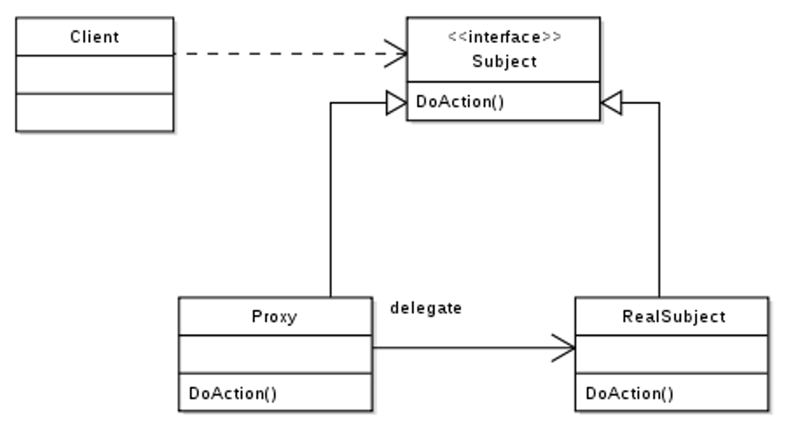

# 프록시 패턴이란?

> 소프트웨어 디자인 패턴 중 하나인 프록시(Proxy) 패턴을 알아보자

- [프록시 패턴이란?](#프록시-패턴이란)
  - [프록시(Proxy) 란?](#프록시proxy-란)
  - [프록시 패턴이란?](#프록시-패턴이란-1)
  - [프록시 패턴의 특징](#프록시-패턴의-특징)
    - [가상 프록시 (Virtual Proxy)](#가상-프록시-virtual-proxy)
    - [보호 프록시 (Protection Proxy)](#보호-프록시-protection-proxy)
    - [원격 프록시 (Remote Proxy)](#원격-프록시-remote-proxy)

## 프록시(Proxy) 란?

웹을 공부하다보면 프록시(Proxy) 라는 용어를 들어볼 수 있다. 예를 들어 `프록시 서버` 설정이라거나, 프론트엔드에서 `프록시`를 설정하는 등 나름 자주 사용되는 용어이다.

그럼 프록시는 무엇일까?

> proxy: 대리, 대리인, 대리권, 대리인의, ...

프록시는 위와 같이 `무엇을 대신해주는 것`의 뜻을 가지고 있다.

이러한 정의가 소프트웨어의 세계에서도 적용된다.

예를 들면 네트워크에서 `프록시 서버`는 클라이언트와 서버 사이에서 데이터를 우회해서 전달해주는 역할을 하는 서버를 의미한다.

## 프록시 패턴이란?

> 프록시 패턴은 어떤 객체를 직접 조작하지 않고 프록시(대리자 객체)를 통해 조작할 수 있도록 프록시 객체를 제공하는 패턴이다.

아래 디자인 패턴 다이어그램을 보면서 조금 더 자세히 알아보자.

출처: [위키피디아](https://ko.m.wikipedia.org/wiki/파일:Proxy_pattern_diagram.svg)

- `Client`: 객체에 접근하고자 하는 사용자
- `Proxy`: `RealSubject` 객체에 대한 프록시 객체
- `RealSubject`: 실제 객체

위와 같이 정의된 프록시 패턴에서 클라이언트는 `RealSubject`를 직접 조작하지 않고 `Proxy`를 통해 조작하게 된다.

위 다이어그램에서 프록시패턴의 특징을 볼 수 있는데, 바로 실제 객체 `RealSubject`와 프록시 객체 `Proxy`가 같은 인터페이스인 `Subject`를 구현한 객체라는 것이다.

같은 인터페이스를 구현했기 때문에 동일한 메소드를 구현해야만 하고, 따라서 `RealSubject`의 로직에 대한 메소드는 항상 `Proxy`에서 실행할 수 있도록 동일한 메소드를 가진다.

## 프록시 패턴의 특징

그렇다면 프록시 패턴의 특징을 알아보자.

- `Proxy` 객체 내부에 `RealSubject`의 인스턴스가 존재해야 한다. (프록시는 결국 중간에서 전달해주는 역할이기 때문에, 전달 받을 실제 객체가 있어야 한다.)
- `Proxy` 객체의 메소드는 `RealSubject`의 메소드 호출 전후로 추가적인 처리를 추가할 수 있다. (ex: 로그 작성 등)
- 그러나 입력 데이터를 변경하거나 결과 데이터를 수정하는 등의 책임 이상의 로직을 추가해서는 안된다.

또한 프록시 패턴은 그 용도에 따라 대표적인 3가지 패턴으로 소개된다.

### 가상 프록시 (Virtual Proxy)

`RealSubject`에 리소스가 굉장히 많이 드는 경우에 사용한다.

즉 `RealSubject`가 생성하는 데 많은 리소스가 필요하기 때문에, `Proxy`를 통해 실제로 객체가 필요할 경우에 접근하여 사용할 수 있다.

### 보호 프록시 (Protection Proxy)

`RealSubject`에 대한 접근을 제어하기 위해 사용한다.

`Proxy`에서 `Client`의 접근에 대한 요청을 제어한다.

예를 들어 접근권한에 따라 접근시킬 `RealSubject`를 변경하는 등 추가적인 접근 제어 로직을 추가한다.

### 원격 프록시 (Remote Proxy)

원격(Remote)에 있는 `RealSubject`에 대한 로컬 프록시 객체인 `Proxy`를 통해 접근하기 위해 사용한다.

두 객체는 같은 메모리상에 존재하지 않지만 `Client`는 `Proxy`를 `RealSubject`라고 생각하고 요청을 보내고 결과를 받을 수 있다.

위의 3가지 프록시 종류는 사실 프록시 패턴의 장점이라고 생각할 수 있다.

그러나 프록시 패턴도 단점은 존재하는데,

- 결국 프록시 객체를 생성해야 하므로 생성이 잦은 경우 성능 저하가 가능하다.
- 프록시 객체 내부에서 스레드를 사용하는 경우 혹은 동기화가 필요한 경우 성능 저하가 가능하다.

그럼에도 Spring의 AOP 등에서 프록시를 이용하여 구현하는 등 굉장히 좋은 디자인 패턴임을 알 수 있다.
