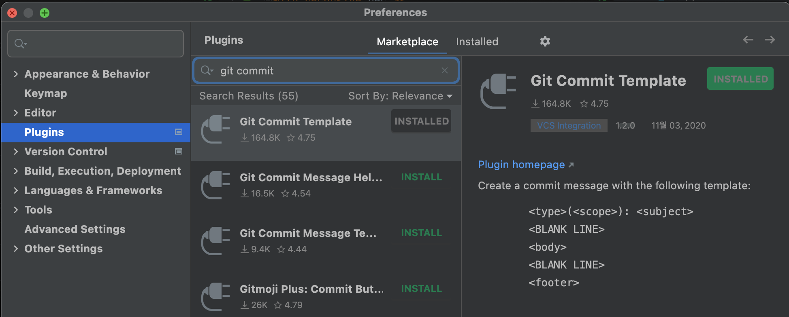
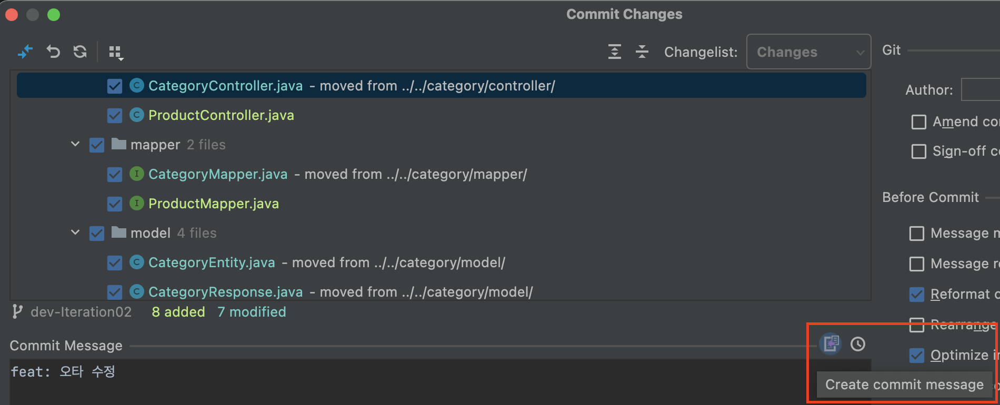
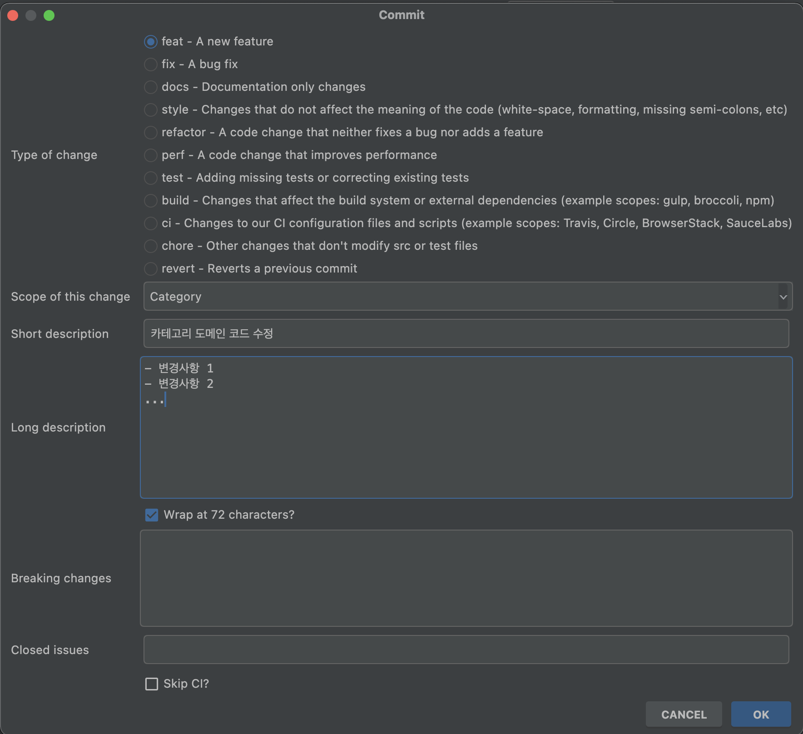
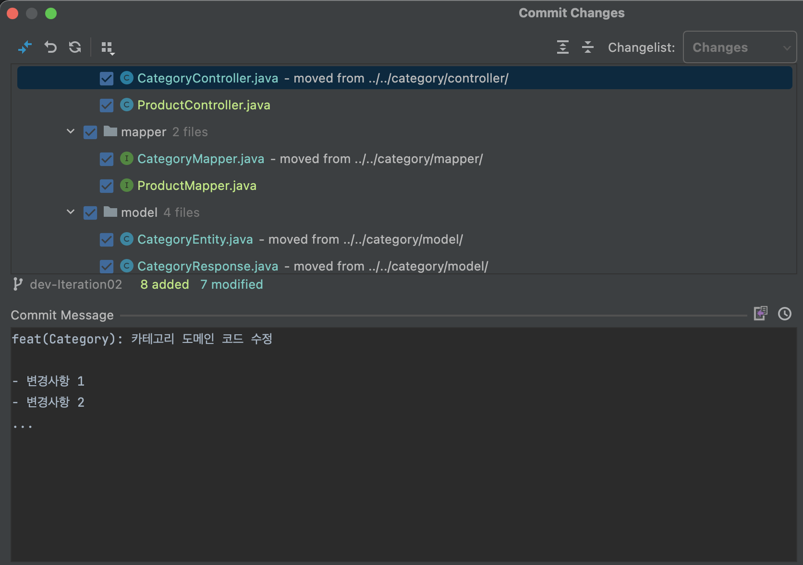

# IntelliJ Commit Convention

> 인텔리제이 IDE 에서 커밋 메세지 입력 시 커밋 컨벤션을 적용하는 방법을 알아보자.

- [IntelliJ Commit Convention](#intellij-commit-convention)
  - [플러그인 설치](#플러그인-설치)
  - [커밋 작성](#커밋-작성)

커밋 컨벤션에 관한 자세한 내용은 [commit-convention](commit-convention.md) 포스트를 참고하면 된다.

- [IntelliJ Commit Convention](#intellij-commit-convention)
  - [플러그인 설치](#플러그인-설치)
  - [커밋 작성](#커밋-작성)

## 플러그인 설치



`IntelliJ IDEA > Preference > Plugins > Marketplace` 에서 `Git Commit Template` 을 검색하여 설치한다.

## 커밋 작성



프로젝트 수정 후 `Command + K` 단축키로 `Commit Changes` 창을 띄우면 위와 같이 플러그인 설치 이전과 다른 버튼이 생긴다.

해당 버튼을 누르면 다음과 같은 창을 통해 다음과 같은 컨벤션에 맞춰서 입력할 수 있다.

```
type<scope>: short-description

body

footer
```

아래는 적용 예시이다.





이처럼 플러그인을 활용해서 IntelliJ IDEA 를 사용하면서 더 좋은 커밋 컨벤션으로 프로젝트를 관리해보자.
