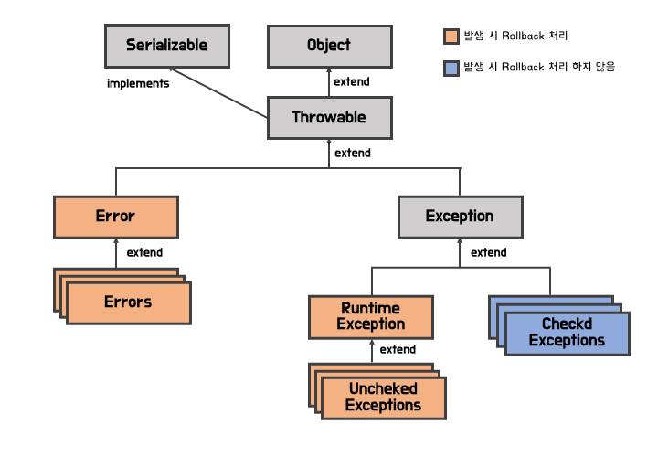

# 예외(Exceptions) 정리

> 자바에서 제공하는 예외 종류인 Checked Exception과 Unchecked Exception을 정리해보자.

- [예외(Exceptions) 정리](#예외exceptions-정리)
  - [Throwable](#throwable)
  - [Error](#error)
  - [Exception](#exception)
    - [RuntimeException (Unchecked Exception)](#runtimeexception-unchecked-exception)
    - [Checked Exception](#checked-exception)

## Throwable

자바의 `Exception` 역시 객체로 존재한다. 따라서 예외를 알아보기 전에 전체적인 구조를 알아보자.



먼저 자바에서는 모두 객체이므로 최상위에 `Object` 클래스가 있다.

그 다음에 나오는 것이 바로 `Throwable` 클래스로, `Object`를 상속받아서 선언되어 있다.

`Throwable` 클래스의 특징은 다음과 같다.

- `Throwable` 클래스나 자식 클래스의 인스턴스만 JVM이 직접 throw 하거나 또는 자바 문법의 `throw` 문을 통해 throw 할 수 있다.
- 마찬가지로 `Throwable` 클래스나 자식 클래스의 인스턴스만 자바 문법의 `catch` 문의 인자로 들어갈 수 있다.
- `Throwable` 클래스를 상속받아서 `Error`와 `Exception` 클래스가 정의된다.

현재 포스팅은 `Exception`에 관한 포스트이므로 더 자세히는 다루지 않고, 자세한 내용은 [Java SE8 oracle docs](https://docs.oracle.com/javase/8/docs/api/)에서 확인할 수 있다.

## Error

`Exception` 클래스를 알아보기 이전에 같은 `Throwable` 클래스를 상속받는 `Error` 클래스에 대해 알아보자.

자바에서 `Error` 클래스의 정의는 다음과 같다.

> 합리적인(Reasonable) 프로그램이 catch 할 수 없는 심각한 문제를 나타내는 클래스

즉 프로그램에서 잡아낼 수 없는 심각한 문제들을 오류라고 본다. 예를 들면 메모리 상 스택이 부족해서 발생하는 `StackOverflowError`나 전체적인 JVM의 메모리가 부족한 `OutOfMemoryError`, 중대한 입출력 에러가 발생한 `IOError` 등이 있다.

위와 같은 문제는 프로그래머가 처리할 수 없는 문제이므로(비정상적인 조건으로 발생하기 때문에) 에러가 발생할 수 있는 클래스나 메소드에서 `throws` 를 할 필요가 없다.

`Error`와 그 하위 클래스는 (즉, 모든 에러는) **Unchecked Exception**으로 간주된다.

## Exception

`Exception` 클래스의 정의는 다음과 같다.

> 합리적인 프로그램이 잡아낼 수 있는 조건을 나타내는 클래스

`Exception` 클래스의 하위 클래스 중 `RuntimeException` 클래스와 그 자식 클래스를 **Unchecked Exception**, 이외의 `Exception`의 하위 클래스를 **Checked Exception**이라고 한다.

```
참고: Spring에서 트랜잭션 설정 중 기본 설정으로 Unchecked Exception이 발생했을 때만 롤백(Rollback)을 진행한다.
```

### RuntimeException (Unchecked Exception)

Runtime 이라는 말에서 나오듯이 `RuntimeException` 클래스는 JVM이 작동중에 발생하는 에외를 나타낸다.

예를 들면 배열 범위를 초과하는 `ArrayIndexOutOfBoundsException`과 같은 예외나 유명한 `NullPointerException` 등이 이에 포함된다.

이와 같은 예외들은 `try ~ catch ~`와 같은 예외 처리를 강제하지 않는다.

### Checked Exception

`RuntimeException` 클래스와 그 하위 클래스를 제외한 모든 `Exception` 들을 **Checked Exception** 이라고 부른다.

이러한 예외들의 특징은 **Uncheckd Exception**과 정 반대로 다음과 같은 특징을 가지고 있다.

- 컴파일 단계에서 검사할 수 있다.
- 예외 처리를 꼭 해야한다.
