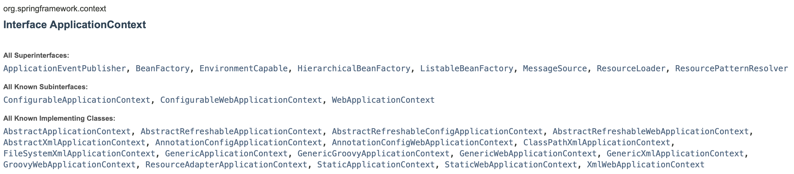

# Application Context 란?

> 스프링을 사용하다보면 대부분 ApplicationContext를 사용하여 스프링 빈을 가져온다. 이 Application Context에 대해 알아보자.

## Application Context

[Spring docs](https://docs.spring.io/spring-framework/docs/current/javadoc-api/org/springframework/context/ApplicationContext.html)의 `ApplicationContext` 인터페이스 부분을 살펴보면 다음과 같이 정의되어 있다.

> "Central interface to provide configuration for an application."
> (Spring docs)

즉 어플리케이션에 대한 **설정 정보**를 제공하는 주요한 인터페이스라는 것이다.

그럼 스프링에서 제공하는 설정 정보라는 것은 어떤 것이 있을까? 주요 기능으로는 스프링 빈에 대한 설정 정보를 제공한다.

`ApplicationContext` 인터페이스 정의를 보면 다음과 같이 정의되어 있다.

```java
public interface ApplicationContext
extends EnvironmentCapable, ListableBeanFactory, HierarchicalBeanFactory, MessageSource, ApplicationEventPublisher, ResourcePatternResolver
```

이 중에서 `ListableBeanFactory`, `HierarchicalBeanFactory`와 같은 `BeanFactory`를 확장하여 인터페이스가 구성되어 있다.

### Bean Factory?

잠깐 `BeanFactory`에 대해서 간단히 알아보자.

스프링 컨테이너의 최상위 인터페이스로, 스프링 설정 파일에 따라 스프링 빈 객체를 생성 및 관리하는 기능을 제공한다.

빈 팩토리(Bean Factory)의 특징으로는 기본적으로 지연 로딩(`Lazy-Loading`) 특징을 가진다는 점이다.

지연 로딩이란 스프링 빈 객체가 필요한 지점에 와서 로딩하는 것을 의미한다.

### Application Context의 특징

앞서 살펴본대로 `ApplicationContext`는 `BeanFactory` 종류 이외에도 여러가지를 확장한 인터페이스이다.

각각의 확장에 따른 `ApplicationContext`에 제공되는 기능을 알아보자. (Spring docs 참고)

- `ListableBeanFactory`: 어플리케이션에 포함된 컴포넌트에 대한 BeanFactory 메소드를 제공한다.
- `ResourceLoader`: 일반적인 방식으로 파일 리소스를 로딩하는 기능을 제공한다.
- `ApplicationEventPublisher`: 등록된 리스너에 이벤트를 제공하는 기능을 제공한다.
- `MessageSource`: 메세지의 국제화(internationalization)를 제공한다. (**국제화**란? Locale에 따른 메세지를 지원할 수 있다.)

또한 추가적인 특징으로는 `ApplicationContext`가 `BeanFactory`의 확장이지만, 기본적으로 지연 로딩(Lazy-Loading) 방식이 아닌 사전 로딩(Pre-Loading) 방식이라는 점이다.

즉, 스프링 컨테이너 구동 시점에 즉 스프링 빈 객체가 필요한 지점 이전에 미리 스프링 빈을 로딩한다.

### ApplicationContext 구현체

앞의 기능을 가지고 있는 `ApplicationContext`는 결국 인터페이스기 때문에 실제 스프링 어플리케이션에서는 특정 구현체로 사용할 수 있다.



위 이미지의 _All Known Implementing Classes_ 목록과 같이 많은 구현체를 사용하여 ApplicationContext를 사용할 수 있다.

몇가지 예를 들어보면,

- `AnnotationConfigApplicationContext`: Java Config 클래스 파일(`@Configuration` 어노테이션 기반)에서 설정 정보를 가져와 스프링 컨테이너를 구성한다.
- `XmlWebApplicationContext`: XML 설정 파일에서 설정 정보를 가져와 스프링 컨테이너를 구성한다.

이 외에도 여러가지 구현체를 통해 스프링 컨테이너를 구성할 수 있다.

위와 같이 여러가지 설정 정보를 통해 사용할 수 있는 이유는 스프링 컨테이너가 `Config.class` 또는 `config.xml`과 같은 특정 파일을 바라보지 않고 `BeanDefinition` 이라는 빈 메타 정보를 읽어오기 때문에 가능하다. (자세한 내용은 따로 포스팅 할 예정이다.)

그리고 이와 같은 `ApplicationContext` 구현체를 스프링 컨테이너라고 부른다.
