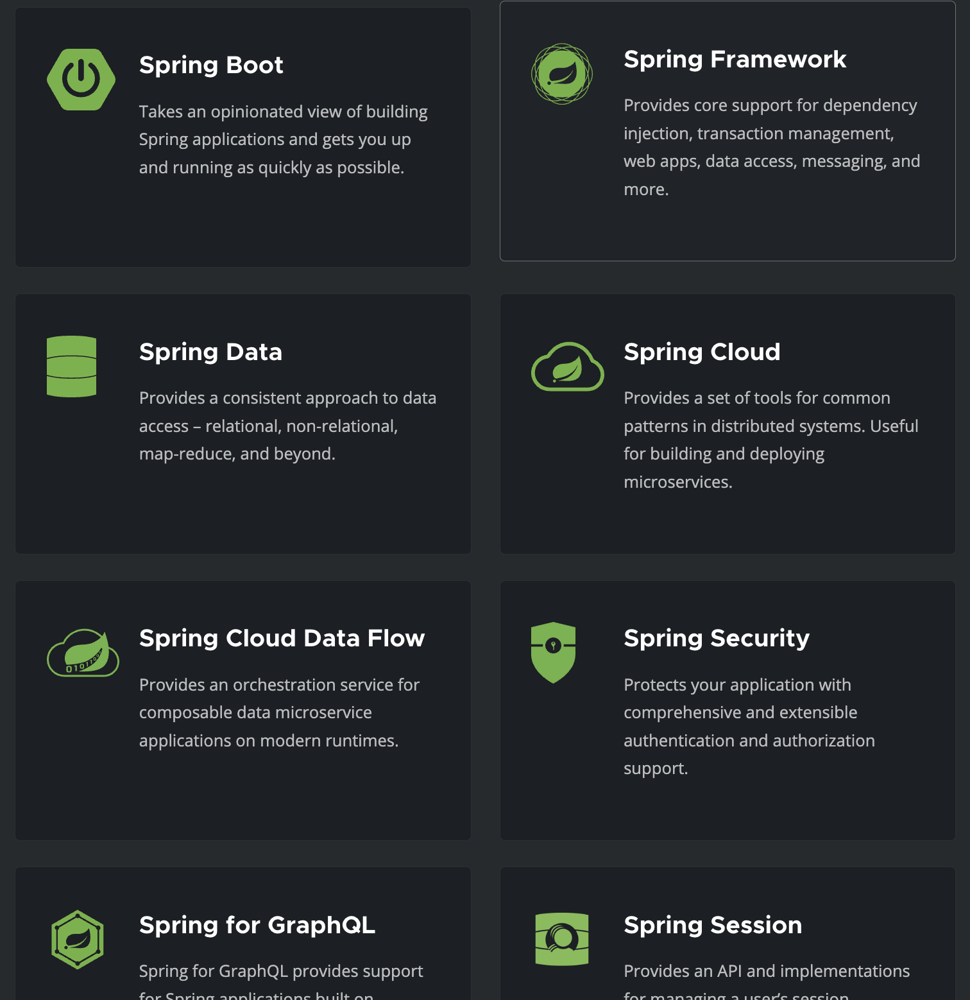

# 스프링 기초 (1)

> 스프링 프레임워크의 기초 배경지식들에 간단하게 대해 알아보자.

- [스프링 기초 (1)](#스프링-기초-1)
  - [1. 스프링의 등장 배경](#1-스프링의-등장-배경)
    - [스프링 등장 이전](#스프링-등장-이전)
    - [스프링의 등장](#스프링의-등장)
  - [2. 스프링?](#2-스프링)
    - [스프링 프레임워크](#스프링-프레임워크)
    - [스프링부트](#스프링부트)
    - [스프링을 쓰면?](#스프링을-쓰면)
  - [참고자료](#참고자료)

## 1. 스프링의 등장 배경

### 스프링 등장 이전

EJB(Enterprise Java Beans) 라는 기술이 당시 자바의 대표 기술이었다.

- 표준 기술로 채택하여 사용했다.
- 분산 처리 기술, 트랜잭션 선언적 처리 등의 강점을 가졌다.
- ORM 기술 또한 지원했다.

위와 같은 이유들로 당시 EJB를 활용한 기술 영업과 보급이 활발했었다. 그러나 장점이 있다면 단점도 존재했는데, 가장 큰 단점으로 **어렵고 복잡했다.**

- EJB 인터페이스에 의존적으로 설계하기 어려워했다.
- 심지어 POJO(Plain Old Java Object), 즉 EJB를 쓰지 말자는 의견까지 발생했다.

### 스프링의 등장

`Rod Johnson`이 `J2EE Design and Evelopment` 라는 책을 발간하며 스프링의 등장을 알렸다. 해당 책의 내용을 통해

- EJB 컨테이너를 단순하게 대체한다.
- 현재까지 사실상의 자바 표준으로 사용한다.
- 스프링의 핵심 개념들인 BeanFactory, ApplicationContext, POJO, 제어의 역전, 의존관계 주입 등의 개념과 기반 코드가 포함되었다.

이러한 책의 내용을 오픈소스로 발전시켜 스프링(Spring) 이라는 이름을 가지고 세상에 등장했다.

> 스프링(Spring): 힘들었던 J2EE(EJB)라는 겨울을 지나 새로운 자바의 봄이 시작되었다는 의미

## 2. 스프링?

스프링은 [스프링 홈페이지 프로젝트 페이지](https://spring.io/projects)에서 확인할 수 있는 많은 프로젝트들이 합쳐진 프로젝트다.

- 스프링 프레임워크 (+ 최근에는 스프링부트까지)는 필수적으로 사용된다.
- 스프링 데이터, 세션, 시큐리티 등 많은 기능들은 필요에 따라 추가하여 사용할 수 있다.

### 스프링 프레임워크

> 스프링의 핵심

- 스프링이 의존관계 주입(DI 컨테이너), AOP, 이벤트 등의 기능을 할 수 있도록 한다.
- 스프링 MVC, WebFlux 등을 지원하여 웹 기술을 제공한다.
- 트랜잭션, JDBC, ORM 등의 데이터 접근 기술을 제공한다.

### 스프링부트

> 스프링 프레임워크를 편리하게 사용할 수 있도록 도와준다.

- 스프링 어플리케이션을 단독으로 실행할 수 있도록 제공한다.
- 톰캣 웹서버를 내장하여 별도의 웹서버 설치 없이 실행할 수 있도록 한다.
- 손쉬운 빌드와 Starter 종속성을 제공한다.
- 스프링과 외부 라이브러리간 버전을 자동으로 구성해준다.

### 스프링을 쓰면?

> 결국 스프링은 좋은 객체지향 어플리케이션을 개발할 수 있도록 도와주는 역할로 시작했다.

스프링은 자바 기반이고, 자바는 객체지향 언어이다. 처음에 EJB를 설명할 때 단점으로 EJB 인터페이스에 의존적이도록 설계하기 어렵다는 단점이 있었는데, 이렇듯 기존의 기술로는 좋은 객체지향 어플리케이션을 설계하기 어려웠다.

그러나 스프링을 통해서 좋은 객체지향 어플리케이션을 개발할 수 있다.

- 다형성 및 OCP/DIP 원칙을 적용할 수 있도록 한다.
  - 일반적으로 다형성을 사용하면 OCP/DIP 원칙을 지키기 어렵다.
  - DI(의존관계 주입) 및 DI 컨테이너 등으로 이를 가능하도록 한다.
- 따라서 클라이언트의 코드 변경 없이 기능을 확장할 수 있다.
- 즉 스프링을 사용하면 [SOLID](../../object-oriented-programming/solid.md) 원칙에 맞는 좋은 객체지향 어플리케이션을 개발할 수 있다.

## 참고자료

[스프링 핵심 원리 - 기본편](https://www.inflearn.com/course/스프링-핵심-원리-기본편)
