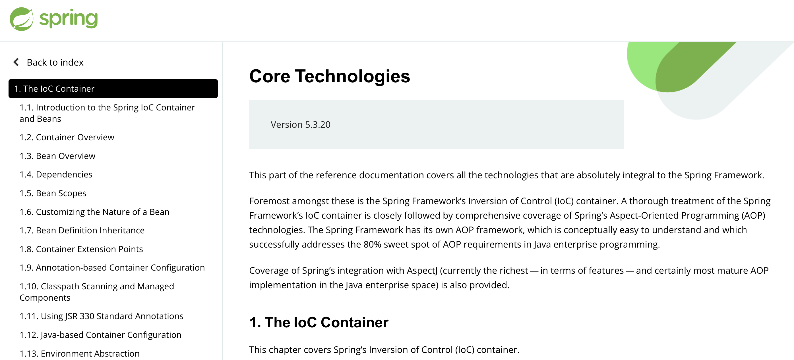

# IOC 컨테이너

> 스프링의 핵심 기능을 담당하는 IOC 컨테이너에 대해 알아보자.

- [IOC 컨테이너](#ioc-컨테이너)
  - [Inversion Of Control](#inversion-of-control)
  - [IOC 컨테이너란?](#ioc-컨테이너란)
  - [IOC 컨테이너 구성](#ioc-컨테이너-구성)
    - [BeanFactory](#beanfactory)
    - [ApplicationContext](#applicationcontext)



[스프링 5.X docs](https://docs.spring.io/spring-framework/docs/current/reference/html/core.html#spring-core)의 핵심 기술 페이지를 보면 첫번째로 등장하는 것이 바로 IOC 컨테이너이다.

등장 순서가 중요도를 나타내는지는 알 수 없지만, 핵심 기술 페이지에서 가장 먼저 설명하는 부분이라는 것 만으로도 IOC 컨테이너의 중요성을 엿볼 수 있다.

## Inversion Of Control

`IOC`는 제어의 역전이라는 말 그대로, 메소드나 객체의 호출 등의 제어권을 프로그래머가 아닌 스프링이 가지고 있는 특징을 의미한다.

스프링 프레임워크는 스프링 빈 객체들을 관린하며, 스프링 빈을 호출하면 등록된 스프링 빈을 제공하여 모든 스프링 빈이 `싱글톤 패턴`을 따르도록 만든다.

이를 가능하게 하는 것이 IOC 컨테이너이다.

## IOC 컨테이너란?

앞서 살펴본 docs의 설명 부분을 잠시 인용하면 IOC 컨테이너는 다음과 같다.

- Inversion Of Control 원칙을 구현한 것이다.
- IOC(Inversion Of Control)는 DI(Dependency Injection)라고도 한다.
- 어떤 객체가 그 객체의 의존성(dependency)인 생성자의 인자(argument)로 정의될 때, 팩토리 메소드로 반환된 객체를 통해 그 속성들을 설정한다.
- IOC 컨테이너는 위 작업을 스프링 빈을 생성할 때 작동한다.

즉, IOC 컨테이너는 `빈 팩토리(BeanFactory)` 라는 핵심 원리로 IOC 원칙을 따를 수 있도록 제공한다. (팩토리 메소드와는 다르니 혼동하지 말자.)

## IOC 컨테이너 구성

### BeanFactory

앞서 살펴본 IOC 컨테이너의 정의처럼 객체 생성 시 의존성을 주입하는 기능을 가지고 있는 IOC 컨테이너의 최상위 인터페이스이다.

```java
public interface BeanFactory {
    ...
}
```

즉, 빈 팩토리는 여러 개의 빈 객체를 생성, 구성, 관리의 역할을 가진 컨테이너이다.

이러한 빈 팩토리를 구현한 구현체를 통행 스프링의 DI가 작동한다.

### ApplicationContext

```java
public interface ApplicationContext extends EnvironmentCapable, ListableBeanFactory, HierarchicalBeanFactory,
		MessageSource, ApplicationEventPublisher, ResourcePatternResolver {
    ...
}
```

`ApplicationContext` 인터페이스를 자세히 살펴보면, `BeanFactory`의 일종인 `ListableBeanFactory`와 `HierarchicalBeanFactory`를 확장한 인터페이스임을 알 수 있다.

docs에서 관련 설명을 확인할 수 있다.

> ApplicationContext is a sub-interface of BeanFactory. It adds:
>
> - Easier integration with Spring’s AOP features
> - Message resource handling (for use in internationalization)
> - Event publication
> - Application-layer specific contexts such as the WebApplicationContext for use in web applications.

즉, 빈 팩토리에서 편리한 여러가지 기능을 확장한 것이 `ApplicationContext`이고, 스프링 프로젝트에서 우리는 `AnnotationConfigWebApplicationContext`와 같은 `ApplicationContext`의 구현체를 선택하여 사용할 수 있다.
