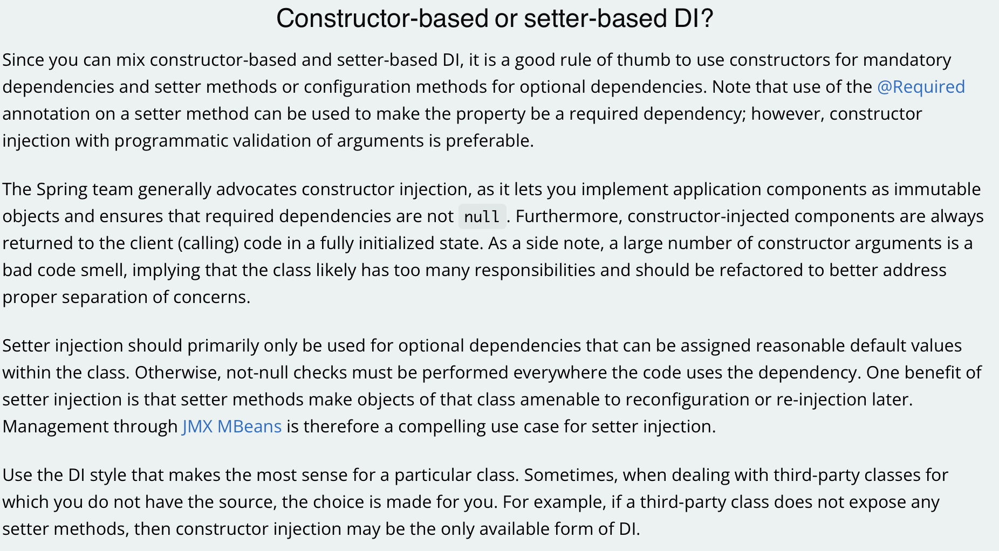

# 의존성 주입(DI)

> 스프링의 핵심 기술 중 하나인 의존성 주입(DI, Dependency Injection)에 대해 간단히 알아보자.

- [의존성 주입(DI)](#의존성-주입di)
  - [의존성 주입(Dependency Injection) 이란?](#의존성-주입dependency-injection-이란)
  - [의존성 주입 방법](#의존성-주입-방법)
    - [생성자 주입](#생성자-주입)
    - [수정자 주입](#수정자-주입)
    - [필드 주입](#필드-주입)
  - [권장하는 의존성 주입 방법](#권장하는-의존성-주입-방법)
  - [Reference](#reference)

## 의존성 주입(Dependency Injection) 이란?

스프링 프레임워크에서 제공하는 강력한 기능으로, 객체 생성 시 의존 관계를 외부에서 주입시켜주는 것을 의미한다.

이때 주입시켜주는 주체를 스프링의 [IOC 컨테이너](ioc-container.md)라고 하고, 주입하는 객체를 스프링 빈 이라고 한다.

즉, 외부에서 스프링 빈을 생성하고 관리하다가, 객체 생성에 스프링 빈이 필요하다면 해당 스프링 빈을 꺼내 주입시켜주는 것을 의미한다.

의존성 주입을 통해 결합도를 낮출 수 있고(= 객체 간 의존성이 줄어든다.), 코드의 재사용성을 높일 수 있다.

## 의존성 주입 방법

> 스프링에서는 의존성 주입을 위한 여러가지 방법을 제공한다. 각 방법의 특징을 알아보자.

### 생성자 주입

생성자 주입은 아래와 같이 생성자를 통해 의존 관계를 주입하는 방법이다.

```java
@Service
public class MyServiceImpl implements MyService {

    private final MyRepository myRepository;

    // Constructor
    @Autowired
    public MyServiceImpl(MyRepository myRepository) {
        this.myRepository = myRepository;
    }

    // ...
}
```

위 코드를 통해 생성자 주입의 특징을 알아보자.

1. 불변: 생성자는 클래스 생성 시 단 한번만 실행된다. 따라서 주입된 의존 관계가 중간에 변하지 않도록 `myRepository`를 `final`로 선언했다.
2. `final`로 선언했기 때문에 `myRepository`는 `null`이 들어갈 수 없다.

위와 같은 특징때문에 생성자 주입이 가장 많이 사용하는 의존성 주입 방식으로 사용된다.

### 수정자 주입

Setter와 같은 수정자를 통해 의존 관계를 주입하는 방식을 수정자 주입이라고 한다.

```java
@Service
public class MyServiceImpl implements MyService {

    private MyRepository myRepository;

    // ...

    // Setter
    @Autowired
    public setMyRepository(MyRepository myRepository) {
        this.myRepository = myRepository;
    }

    // ...
}
```

자바에서는 일반적으로 Getter라는 속성값을 가져오는 메소드와 Setter라는 속성값을 수정하는 메소드를 통해 객체 내부의 속성을 수정한다.

스프링에서는 이러한 Setter를 통해 의존 관계를 주입하는 방식을 제공한다.

- 스프링은 먼저 스프링 IOC 컨테이너에 스프링 빈들을 등록한다. (`MyServiceImpl` 생성자 실행)
- 스프링 빈 등록이 완료되면 이후 의존 관계를 주입한다. (`setMyRepository` Setter 메소드 실행)

따라서 스프링 빈 등록과 의존 관계 주입 단계가 분리되었기 때문에 두번째 단계에서 Setter를 통해 의존 관계를 주입한다.

수정자 주입의 특징은 다음과 같다.

- 선택적인 의존성 주입이 가능하다.
- 여러개의 파라미터를 가진 Setter 메소드를 통해 한번에 의존성 주입이 가능하다.
- 변화 가능: 그러나 `final`을 사용할 수 없으므로 의존성이 변할 수 있는 가능성이 있다.

### 필드 주입

> 필드 주입은 현재 스프링에서 잘 사용하지 않는다. 사용하려고 하면 `Field Injection is not recommended.` 라는 경고 메세지를 띄운다.

필드 주입은 의존 관계를 설정할 필드에 바로 주입을 해 주는 방식이다.

```java
@Service
public class MyServiceImpl implements MyService {

    // field
    @Autowired private MyRepository myRepository;

    // ...
}
```

특징으로는 코드가 간결해진다는 장점이 있다.

그러나 다음과 같은 단점들로 인해 현재 권장되지 않는 방법이다.

- 테스트의 어려움: `myRepository` 필드를 사용하기 위해서는 스프링 DI 컨테이너가 의존성을 주입해야만 사용할 수 있다. 즉, DI 컨트롤러와의 의존성이 높아져 테스트가 어려워진다. (스프링 프레임워크 없이는 테스트가 힘들다.)
- 변화 가능: `final`을 사용한 생성자 주입 방식과 다르게, 주입한 의존성이 변할 수 있는 가능성이 있다.

## 권장하는 의존성 주입 방법

위와 같은 의존성 주입 방식 중에서, 최근 스프링에서 권장하는 방식은 생성자 주입 방식이다.



[스프링 docs](https://docs.spring.io/spring-framework/docs/current/reference/html/core.html)의 `Constructor-based or setter-based DI?` 라는 내용을 확인해보면 어떤 방식을 권장하는지 알 수 있다.

간단히 정리하면 다음과 같다.

- 의존성 주입을 위해 생성자 주입과 수정자 주입을 혼합해서 사용할 수 있다.
- 필수 종속성을 주입할 때에는 생성자 주입을 사용한다.
- 선택적 종속성을 주입할 때에는 수정자 주입을 사용한다.
- **일반적으로 생성자 주입을 권장한다.**
  - 어플리케이션 내에서 주입된 필드가 변경되지 않는 것을 보장한다.
  - 또한 필요한 종속성이 `null`이 아님을 보장한다.
  - 마지막으로 생성자에서 주입하기 때문에 항상 의존성이 초기화(주입)된 상태로 사용자에게 제공된다.
- 수정자 주입을 사용할 경우 `null` 검사의 필요성이 많아진다.

따라서 가능하면 생성자 주입을 사용하면서, 꼭 필요할 때 수정자 주입을 사용하도록 하자.

## Reference

[spring docs](https://docs.spring.io/spring-framework/docs/current/reference/html/core.html)
[김영한-스프링 핵심 원리 기본편](https://www.inflearn.com/course/스프링-핵심-원리-기본편) 정리
