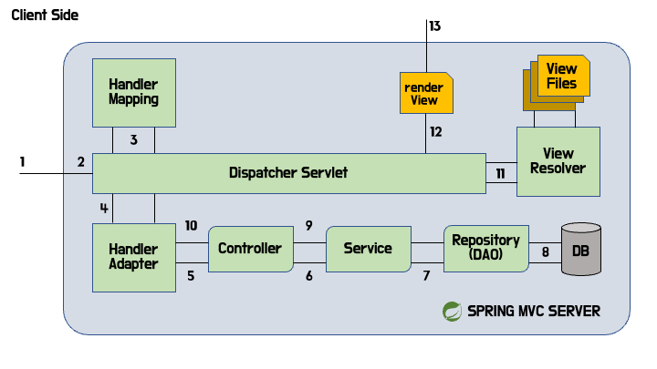

# 스프링 구동 순서

(출처 : https://yoo-hyeok.tistory.com/139)

**1. 어플리케이션 실행 시 Tomcat 에서 web.xml을 로딩한다.**

- 각종 설정을 위한 파일인 web.xml을 로딩한다.
- Java Config의 경우 `WebApplicationInitializer`의 구현체인 SpringApplication.java와 같은 클래스를 로딩한다.

**2. ContextLoaderListener 생성**
설정 파일에서 `ContextLoaderListener` 가 자동으로 생성된다.

- `ApplicationContext`을 생성하는 역할을 가진다.
- `Servlet`의 생명주기를 관리한다.

**3. ContextLoaderListener 에서 root-context.xml 을 로딩한다.**

- Java Config의 경우 AppConfig.java 와 같은 파일에서 아래 설정을 하도록 구현하여 로딩한다.

**4. root-context.xml 에서 스프링 컨테이너를 구동한다.**

- WEB 과 관련 없는 스프링 빈을 설정한다. (Service 등)

**5. 클라이언트의 요청이 발생한다.**

**6. `DispatcherServlet`을 생성한다.**

- 생성된 `DispatcherServlet`이 두번째 스프링 컨테이너를 생성하고, Controller 객체들을 생성한다.
- 일반적으로 `DispatcherServlet`이 FrontController 역할을 수행한다.

- 요청 메세지를 분석하여 알맞은 Page Controller 전달하고 응답한다.

**7. servlet-context.xml 로딩**

- `DispatcherServlet`이 servlet-context.xml 파일을 로딩한다.
- Java Config의 경우 `WebMvcConfigurer`의 구현체인 WebConfig.java와 같은 파일을 로딩한다.
- 로딩된 파일에서 스프링 컨테이너를 스프링 빈으로 등록한다.

**8. 실행 (Running)**
