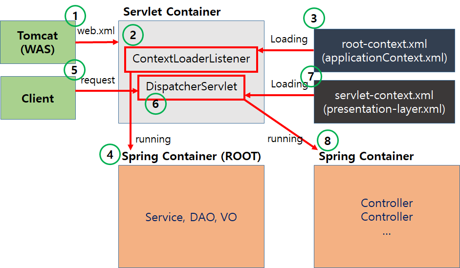

# Spring MVC 요청 처리

> 스프링 MVC에서 클라이언트의 요청이 들어왔을 때 응답할 때까지의 과정을 간단히 알아보자.



### 1. 클라이언트에서 서버로 HTTP Request를 전송한다.

### 2. `Dispatcher Servlet`이 요청을 가져온다.

web.xml 혹은 아래처럼 Java Config의 addMapping 메소드 등으로 지정된 URL에 대해서 서블릿 매핑을 진행한다.

일반적으로 매핑 주소에 “/” 를 사용하여 모든 url에 대해서 요청을 가져올 수 있도록 한다.

```java
public class SpringApplication implements WebApplicationInitializer {
...
	dispatcher.setLoadOnStartup(1);
	dispatcher.addMapping("/");
...
}
```

### 3. `Dispatcher Servlet`이 `Handler Mapping`에게 어떤 컨트롤러를 매핑시켜줄 것인지 검색한다.

HandlerMapping은 이미 컨트롤러를 스캔했기 때문에, URL 분석 등의 방법으로 매핑할 컨트롤러를 검색하여 반환한다.

### 4. 컨트롤러 객체를 반환받은 `Dispatcher Servlet`이 요청을 처리할 메소드를 검색한다.

`Handler Adapter`를 통해 `@RequestMapping` (혹은 `@GetMapping`, `@PostMapping` 등) 어노테이션이 있는 요청을 처리할 메소드를 검색한다.

### 5. `Handler Adapter`가 컨트롤러의 해당 메소드를 실행시켜 요청을 처리한다.

컨트롤러가 요청을 처리하기 위해, 컨트롤러는 로직을 처리할 서비스를 DI(Dependency Injection, 의존성 주입)하여 비즈니스 로직을 처리하도록 한다.

### 6. 컨트롤러가 서비스에서 비즈니스 로직을 구현하여 요청에 대한 로직을 처리한다.

서비스는 비즈니스 로직을 처리하기 위해 대부분의 코드가 작성되어 있다.

### 7. 서비스는 비즈니스 로직 처리를 위해 데이터베이스 접근이 필요할 경우 `DAO(Data Access Object)`를 통해 데이터베이스 접근을 처리한다.

서비스도 마찬가지로, 데이터베이스 접근이 필요할 경우 서비스 또한 데이터베이스 접근을 처리할 `DAO(Data Access Object)`를 DI하여 데이터베이스 접근을 처리하도록 한다.

DAO에서 데이터베이스 접근 시 mybatis, hibernate 등 라이브러리를 사용하여 쿼리를 입력할 수 있다.

### 8. DAO가 데이터베이스에 접근하여 요청을 처리하고 결과를 반환한다.

### 9. 서비스가 비즈니스 로직을 마친 후 결과물을 컨트롤러에 반환한다.

### 10. 결과를 반환받은 컨트롤러는 `DispatcherServlet` 으로 결과를 반환한다.

`@ResponseBody`나 `@RestController` 어노테이션을 사용하면서 처럼 직접 모델 객체를 반환하거나 `view(.jsp)`를 직접 반환할 수 있다.

### 11. `Dispatcher Servlet`이 `View Resolover`을 통해 받은 뷰에 대한 정보를 검색하여 가져온다.

### 12. 응답할 view(.jsp)를 찾은 뒤 `Dispatcher Servlet`이 View에게 Render를 지시하고, View에서 응답 로직을 처리한다.

### 13. 결과적으로 `Dispatcher Servlet`이 클라이언트에게 응답으로 랜더링 된 View를 HTTP Response로 제공한다.

참고:[https://jeong-pro.tistory.com/96](https://jeong-pro.tistory.com/96)
