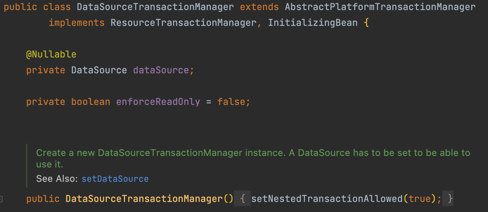
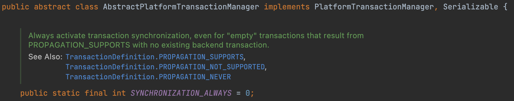

# 스프링 삼각형

> 스프링 삼각형으로 불리는 스프링의 대표적인 3가지 특성을 간단히 알아보자.

- [스프링 삼각형](#스프링-삼각형)
  - [스프링 삼각형이란?](#스프링-삼각형이란)
  - [IOC/DI](#iocdi)
  - [AOP](#aop)
  - [PSA](#psa)

## 스프링 삼각형이란?

스프링을 사용하면 `POJO(Plain Old Java Object)` 를 바탕으로 나타나는 `IOC/DI`, `AOP`, `PSA` 의 3대 프로그래밍 모델을 스프링 삼각형이라고 부른다.

## IOC/DI

> IOC: Inversion Of Control, 제어의 역전
>
> DI : Dependency Injection, 의존성 주입

먼저 `DI`를 살펴보자.

`DI`는 스프링 프레임워크에서 제공하는 특징으로, 객체를 직접 생성하는 것이 아닌 외부에서 생성하여 주입시켜주는 방식을 의미한다.

스프링에서 사용하는 `Controller`, `Service` 등의 객체를 스프링 빈(`Bean`) 이라고 부르는데, 이런 스프링 빈들을 외부에서 주입함으로써 객체간 결합도를 낮출 수 있으므로 유연성 높은 코드를 작성할 수 있다.

다음으로 `IOC`를 살펴보자.

`IOC`는 제어의 역전이라는 말 그대로, 메소드나 객체의 호출 등의 제어권을 프로그래머가 아닌 스프링이 가지고 있는 특징을 의미한다.

스프링 프레임워크는 앞서 소개한 `DI`처럼 스프링 빈을 관리하기도 하며, 스프링 빈을 호출하면 등록된 스프링 빈을 제공하여 모든 스프링 빈이 `싱글톤 패턴`을 따르도록 만든다.

또한 프레임워크에서 객체를 관리해주므로 프로그래머의 편의성도 제공한다.

## AOP

> AOP : Aspect Oriented Programming, 관점 지향 프로그래밍

AOP는 객체지향 프로그래밍처럼 프로그래밍 방법론 중 하나로, 관점 지향 프로그래밍의 약자이다.

관점 지향이란 로직(코드)을 관점별로 나누어 그 관점별로 모듈화하여 프로그래밍 하자는 의미이다.

[스프링 2.5 docs](https://docs.spring.io/spring-framework/docs/2.5.x/reference/aop.html)에서 설명하는 AOP의 주요 개념들은 다음과 같다.

- Aspect: 여러 클래스에서 사용하는 관심사를 모듈화 한 것을 의미한다.
- Join point: 프로그램 실행 중 지점을 나타냄. 스프링 AOP에서는 항상 메소드 실행을 의미한다.
- Advice: `before`, `after` 등의 특정 Join point에서의 행동을 의미한다.
- Pointcut: 필터링된 Join point를 의미한다. 위의 `Advice` 가 모든 `Pointcut`에서 실행된다.
- Introduction: Advice가 적용될 메소드에 추가적인 인터페이스를 적용할 수 있다.
- Target object: AOP를 적용할 대상(클래스, 메소드 등)을 의미한다.
- AOP proxy: AOP를 적용하기 위해 AOP 프레임워크에서 생성한 객체를 의미한다.
- Weaving: 지정된 객체에 Aspect를 부여해서 새로운 프록시 객체를 생성하는 것을 의미한다. 스프링 AOP는 이 프록시 객체를 이용한다.

이러한 AOP를 활용하면 관점별로 코드를 분리하므로 중복 코드 제거 및 효율적인 유지보수가 가능하다.

## PSA

> PSA : Portable Service Abstraction

`Service Abstraction` 이란 어떤 서비스를 사용할 때 그 서비스의 내용을 모르더라도 서비스를 사용할 수 있도록 추상화함을 의미한다.

예를 들어 `@Transactional` 어노테이션을 추가하면 그 메소드(클래스)가 트랜잭션에 걸려서 작동한다거나, `jdbc-driver`를 통해 데이터베이스에 접근할 수 있다. 그러나 개발자는 이러한 서비스들이 내부적으로 어떤식으로 구현되어있는지 알지 않아도 된다.

여기에 `Portable` 이라는 명사가 추가됨으로써 환경 변화와 관계없이 이러한 서비스에 일관적으로 접근할 수 있도록 제공한다.

즉, 스프링의 라이브러리들은 그 특정 기술에 의존적이지 않도록 POJO 기반으로 추상화하여 작성되어 있다.

트랜잭션을 다시 예를들어보자.

보이는 것 처럼 `DataSourceTransactionManager`를 사용하면 해당 클래스는 위와 같이 구성되어 있다.

`AbstractPlatformTransactionManager`를 확장하여 사용하는데, 이를 자세히 살펴보면 `PlatformTransactionManager` 인터페이스의 구현체이다.

만약 JDBC가 아닌 JPA를 사용한다면 `JPATransactionManager`를 사용하게 되는데, 이를 따로 구현하는 것이 아닌 최상위 인터페이스를 받아서 구현하도록 되어있다.

이러한 특징들로 인해 스프링의 라이브러리들은 기술에 종속적이지 않아서 환경의 변화에 자유롭게 대처할 수 있다.
