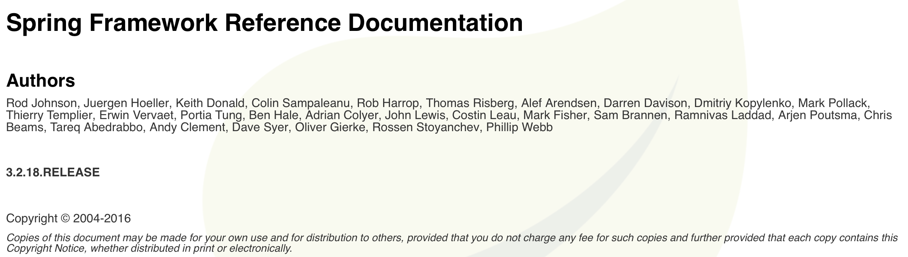
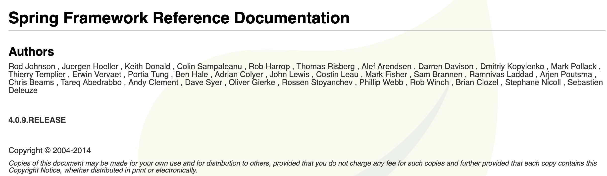
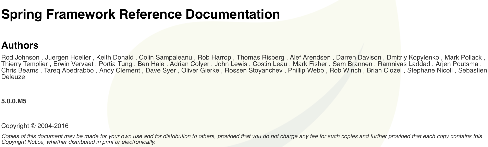

# 스프링 버전 별 특징

> 스프링 프레임워크의 버전별 특징을 간단히 살펴보자.

- [스프링 버전 별 특징](#스프링-버전-별-특징)
  - [Spring version 3.0](#spring-version-30)
    - [Spring 3.0 변경사항](#spring-30-변경사항)
  - [Spring version 4.0](#spring-version-40)
    - [Spring 4.0 변경사항](#spring-40-변경사항)
  - [Spring 5.0](#spring-50)

## Spring version 3.0

[Spring 3.2.18 RELEASE NOTE](https://docs.spring.io/spring-framework/docs/3.2.x/spring-framework-reference/html/index.html)



### Spring 3.0 변경사항

- Generics, varargs 등 Java 5버전의 개선사항을 활용할 수 있도록 개선
- Spring 문서 개선
- article과 tutorial 개선
- 모듈 jar당 하나의 소스 트리로 별도로 관리하도록 수정
- [Spring Expression Language (SpEL)](https://docs.spring.io/spring-framework/docs/3.2.x/spring-framework-reference/html/expressions.html) 도입
- `@Configuration, @Bean` 등의 어노테이션 지원 및 어노테이션을 통한 DI 지원
- Spring framework core에 `OXM(Object XML Mapping function)` 추가
- Rest API 지원 추가
  - 서버: annotation driven MVC web framework 확장
  - 클라이언트: RestTemplate 추가
- Spring MVC 설정을 위한 어노테이션 추가 (`@CookieValue, @RequestHeaders` 등)
- `@Async` 어노테이션을 통한 Java EE 6의 비동기 메소드 호출 조기 지원
- `H2, HSQL` 등 임베디드 데이터베이스 엔진 관련 기능 제공

## Spring version 4.0

[Spring 4.0 RELEASE NOTE](https://docs.spring.io/spring-framework/docs/4.0.x/spring-framework-reference/html/)



### Spring 4.0 변경사항

- Getting Started 향상: spring.io 사이트 및 Starter Pack 제공
- 불필요한 패키지 제거
- Java 6~8 지원 (Java 8의 람다 표현식 및 메소드 참조 등 지원)
- Java EE 6, 7 권장 (JPA 2.0 및 Servlet 3.0 권장)
- `Groovy DSL`을 이용한 Bean 정의 제공으로 부트스트랩 등에서의 편의성 제공
- Core 컨테이너 개선
  - 스프링 빈 삽입 시 generic 타입도 qualifier로 취급: `@Autowired Repository<Customer> customerRepository`와 같이 손쉬운 표현 사용 가능
  - 스프링 메타 어노테이션 지원 및 사용자 정의 주석 사용 가능
  - 빈 정렬 추가: `@Order, Ordered interface` 등
  - DI 지점 정의 가능: `@Lazy`
  - 빈 조건부 필터링: `@Conditional`
- 웹 기능 개선
  - Servlet 3.0+ 버전 권장
  - Spring MVC 어플리케이션의 `@RestController` 어노테이션 추가 (`@RequestBody`를 일일히 추가하지 않아도 됨)
  - `AsyncRestTemplate` 클래스: RestAPI 개발 시 non-blocking 비동기 지원
  - 포괄적 timezone 제공
- WebSocket, SockJS 및 STOMP 메시징 지원
- Test 개선
  - spring-test 모듈의 불필요한 파일 제거
  - spring-test의 대부분의 어노테이션을 메타 어노테이션으로 등록: 사용자 정의 어노테이션 추가 가능

## Spring 5.0

> spring 5.0 버전은 변경사항이 꽤 많아서 [spring-framework github](https://github.com/spring-projects/spring-framework/wiki/What%27s-New-in-Spring-Framework-5.x#whats-new-in-version-50)를 참고했다.

[Spring 5.0 RELEASE NOTE](https://docs.spring.io/spring-framework/docs/5.0.0.M5/spring-framework-reference/html/)



- Java 8 기반 프레임워크 바탕으로 변경
- 불필요한 패키지 제거
- Java 8 reflection 기반 효율적인 메소드 파라미터 접근
- JDK 7 Charset과 StandardCharsets 향상성 적용
- JDK 9 호환성 제공
- 패키지 레벨의 Non-null 선언
- 공통 Logging bridge 제공: Log4j 2.x, SLF4J, JUL 등을 자동 감지
- Core Container 개선
  - 선택적 injection 지점에 `@Nullable` 지원
  - Supplier-based 빈 등록 API (사용자 정의 callback을 통한 빈 등록)
  - xml 네임스페이스 간소화 (버전 제거)
- Spring MVC 개선
  - Servlet 3.1 완전 지원
  - Servlet 4.0 PushBuilder argument 지원
  - `MediaTypeFactory`: Java Activation Framework 대체
  - 불변 객체 데이터 바인딩 제공 (Kotlin, Lombok, `@ConstructorProperties` 등)
  - JSON 바인딩 API 지원: `Jackson` and `GSON` 대체 - Eclipse `Yasson` 또는 Apache `Johnzon`
- 반응형 프로그래밍 제공: `spring-webflux` 모듈
- Kotlin 지원

```
더 많은 기능이 있지만 docs가 너무 방대해서 주요 키워드 위주로 정리했다. 자세한 내용은 docs와 github를 참고하자.
```
