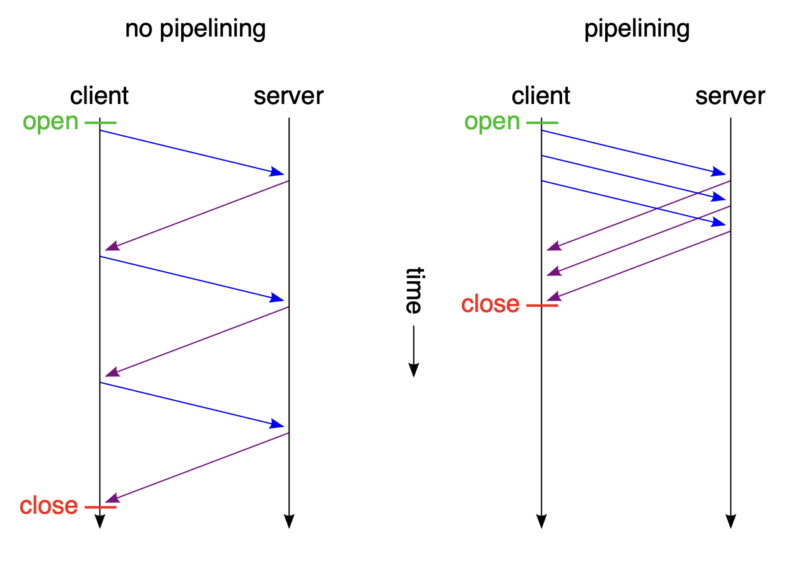

# TCP HTTP 역사

> TCP 프로토콜에서 사용해온 HTTP/0.9, HTTP/1.X, HTTP/2.0 버전의 역사를 알아보자.

- [TCP HTTP 역사](#tcp-http-역사)
  - [1. WWW (World Wide Web)](#1-www-world-wide-web)
  - [HTTP/0.9](#http09)
    - [예시](#예시)
  - [HTTP/1.0](#http10)
    - [한계](#한계)
    - [예시](#예시-1)
  - [HTTP/1.1](#http11)
    - [한계점](#한계점)
    - [예시](#예시-2)
  - [HTTP/2.0](#http20)
  - [HTTP/3.0](#http30)
  - [래퍼런스](#래퍼런스)

## 1. WWW (World Wide Web)

1989년 `Tim Berners-Lee`는 인터넷 상에서의 하이퍼텍스트 시스템을 제안한다.

초기에 시스템의 이름을 `Mesh` 라고 정하고, 이후 `WWW(월드 와이드 맵)` 로 변경했다.

`WWW` 는 기존 TCP와 IP 프로토콜 상에서 작동하며, 다음과 같은 4개의 블록으루 구성된다.

- `HTML`: 하이퍼텍스트 문서를 표현하기 위한 텍스트 형식의 **하이퍼텍스트 마크업 언어**이다.
- `HTTP`: 문서 같은 것을 교환하기 위한 간단한 프로토콜인 **하이퍼텍스트 전송 프로토콜**이다.
- `브라우저`: 문서를 표시하고 수정하기 위한 클라이언트인 **월드 와이드 웹(WorldWideWeb)이라고 불리는 첫번째 브라우저**이다.
- `httpd의 초기 버전`: 문서에 접근하도록 한다.

## HTTP/0.9

- 초기 버전의 `HTTP`에는 버전이 없었고, 이후 발전한 `HTTP` 버전들과 구분하기 위해 이때의 `HTTP`를 0.9 버전으로 정했다.
- `원라인 프로토콜`: 요청은 단일 라인으로 구성된다.
- `GET` 메소드의 요청만 가능하다.
- 요청에 대한 응답으로 `HTML` 파일의 내용을 응답한다.

### 예시

요청:

```
GET /mypage.html
```

응답:

```
<HTML>
A very simple HTML page
</HTML>
```

## HTTP/1.0

- 앞서 살펴본 `HTTP/0.9` 는 굉장히 제한적이다. (단순한 요청과 HTML 파일의 응답만 가능하다.)
- 1.0 버전부터 버전이라는 개념이 등장했고, 요청 시 `HTTP` 버전 정보를 함께 요청한다.
- `상태 코드`: 응답의 시작 부분에 `200 OK` 와 같은 상태 코드가 함께 전송된다. 요청에 대한 처리 여부를 반환하여 클라이언트가 대응할 수 있도록 제공한다.
- `HTTP 헤더`: `HTTP` 프로토콜을 유연하게 하기 위해서 헤더의 개념이 요청과 응답 **모두** 도입되었다.
- `메타 데이터 전송`: `HTTP/1.0` 부터 응답으로 `HTML` 이외의 다른 파일을 전송할 수 있게 되었다. (`Content-Type` 요소를 통해 명시한다.)

### 한계

- 매 요청마다 새로운 TCP 연결을 생성한 뒤 통신한다.
- 표준화가 이루어지기 위해 여러 구현이 진행되었다.

### 예시

요청:

```
GET /myimage.gif HTTP/1.0
User-Agent: NCSA_Mosaic/2.0 (Windows 3.1)
```

응답:

```
200 OK
Date: Tue, 15 Nov 1994 08:12:32 GMT
Server: CERN/3.0 libwww/2.17
Content-Type: text/gif
(image content)
```

## HTTP/1.1

`HTTP/1.1` 은 `HTTP/1.0`의 모호함을 해결하기 위해 제시되었다.

- `커넥션 재사용`: `Persistent Connection` 이라고 불리는 기능으로, 지정된 시간 내에 재요청이 들어오면 기존 커넥션을 이용해 통신한다.
- `파이프라이닝`: 첫번째 요청에 대한 응답이 완전히 전송되기 이전에 두번째 요청 전송을 가능하게 한다.
  
- `Chunked Message 지원`: 큰 메세지를 작은 단위로 잘라서 전송할 수 있다.
- 추가적인 캐시 제어 메커니즘이 도입된다.
- 클라이언트와 서버로 하여금 교환하려는 가장 적합한 컨텐츠에 타입을 결정할 수 있도록 한다.
- `Host 헤더`: 동일 IP 주소에 다른 도메인을 호스트하는 기능이 서버 코로케이션을 가능케 합니다. (`가상 호스팅`이라고도 한다.)
- `프록시 인증`: `HTTP/1.0`에서도 `www-authentication` 헤더가 있었지만, 클라이언트와 서버 사이에 프록시가 존재할 경우 `proxy-authentication`, `proxy-authorization`
  과 같은 헤더로 추가적인 프록시단의 인증을 진행할 수 있게 되었다.

### 한계점

- 한 커넥션 내에서 하나의 요청씩 처리한다.
  - 즉, 동시에 리소스를 주고 받는 것이 불가능하다.
  - 순차적인 처리 방식으로 많은 리소스를 처리하기 위해서는 다른 요청의 **대기시간(Latency Time)이 길어진다.**
  - `RTT(Round Trip Time)`이 증가한다. (반복적인 3-Way handshake가 발생하기 때문이다.)
- `HOL(Head Of Line) Blocking`이 발생할 수 있다.
  - HOL 블로킹: 동일 네트워크에서 첫 번째 패킷에 의해 이후 패킷들이 지연되는 것을 의미한다.
- `HTTP` 헤더 구조가 무겁다.
  - 중복된 헤더 값을 반복하게 전송하게 되며, 추가적으로 서버의 쿠키 정보 등을 포함하여 오버헤드가 발생한다.

### 예시

요청1:

```
GET /en-US/docs/Glossary/Simple_header HTTP/1.1
Host: developer.mozilla.org
User-Agent: Mozilla/5.0 (Macintosh; Intel Mac OS X 10.9; rv:50.0) Gecko/20100101 Firefox/50.0
Accept: text/html,application/xhtml+xml,application/xml;q=0.9,*/*;q=0.8
Accept-Language: en-US,en;q=0.5
Accept-Encoding: gzip, deflate, br
Referer: https://developer.mozilla.org/en-US/docs/Glossary/Simple_header
```

응답1:

```
200 OK
Connection: Keep-Alive
Content-Encoding: gzip
Content-Type: text/html; charset=utf-8
Date: Wed, 20 Jul 2016 10:55:30 GMT
Etag: "547fa7e369ef56031dd3bff2ace9fc0832eb251a"
Keep-Alive: timeout=5, max=1000
Last-Modified: Tue, 19 Jul 2016 00:59:33 GMT
Server: Apache
Transfer-Encoding: chunked
Vary: Cookie, Accept-Encoding
(content)
```

요청2:

```
GET /static/img/header-background.png HTTP/1.1
Host: developer.mozilla.org
User-Agent: Mozilla/5.0 (Macintosh; Intel Mac OS X 10.9; rv:50.0) Gecko/20100101 Firefox/50.0
Accept: */*
Accept-Language: en-US,en;q=0.5
Accept-Encoding: gzip, deflate, br
Referer: https://developer.mozilla.org/en-US/docs/Glossary/Simple_header
```

응답2:

```
200 OK
Age: 9578461
Cache-Control: public, max-age=315360000
Connection: keep-alive
Content-Length: 3077
Content-Type: image/png
Date: Thu, 31 Mar 2016 13:34:46 GMT
Last-Modified: Wed, 21 Oct 2015 18:27:50 GMT
Server: Apache

(image content of 3077 bytes)
```

위에서 보는 것 처럼 유명한 헤더인 `Keep-Alive` 헤더를 통한 커넥션 유지가 진행된다.

## HTTP/2.0

`HTTP/1.1`이 많은 확장성을 제공하면서, 긴 시간동안 발전해오고 많은 기능이 추가된다.

또한 웹 페이지가 더 많은 정보를 표현하면서 하나의 애플리케이션으로 인식된다.

이러한 상황에서 `HTTP/1.1`이 종종 문제가 발생했고, `Google`에서 `SPDY 프로토콜` 등을 실험하며 `HTTP/2.0`의 기반이 되었다.

- `Multiplexed Streams`: `HTTP/2.0`은 동일 커넥션 내에서 병렬 요청을 처리할 수 있는 `다중화 프로토콜`이다. `HTTP/1.x` 프로토콜의 문제점인 순서를 제거할 수 있다.
- `오버헤드 최적화`: 전송된 데이터의 중복과 데이터로부터 유발된 불필요한 오버헤드를 제거한다. 또한 연속된 요청 사이의 중복된 내용의 헤더를 압축한다. (`HPACK` 압축 방식이라고 불린다.)
- `Stream Prioritization`: 리로스간 의존관계를 파악하여 설정한 우선순위에 따라 로딩하여 로딩시 발생하는 문제를 해결한다.
  - `서버 푸쉬 매커니즘`: 클라이언트 캐시를 필요하게 될 데이터로 채워넣도록 허용한다.

## HTTP/3.0

`HTTP/3.0` 버전은 `TCP` 프로토콜이 아닌 `UDP` 기반 `QUIC` 프로토콜에서 작동한다.

이 부분은 추후 다른 포스팅에서 다루도록 하겠다.

## 래퍼런스

https://developer.mozilla.org/ko/docs/Web/HTTP/Basics_of_HTTP/Evolution_of_HTTP

https://velog.io/@wiostz98kr/HTTP1.1과-HTTP2.0의-차이-e2v4x4t1
