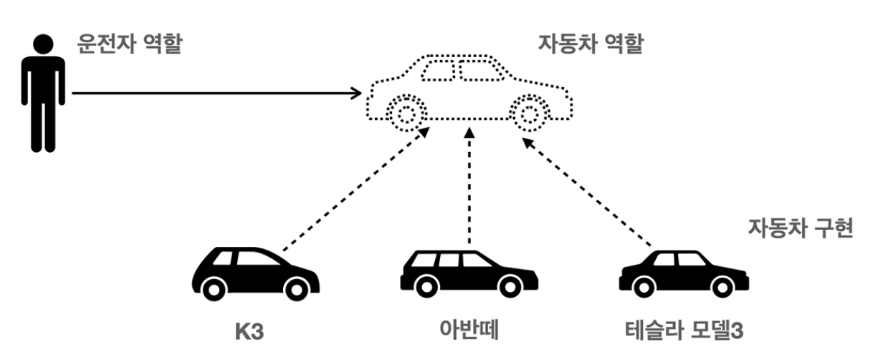

# SOLID 5원칙

> 해당 내용은 면접, 정보처리기사 등에 자주 등장하므로 이해하면 좋다.

- [SOLID 5원칙](#solid-5원칙)
  - [SOLID란?](#solid란)
    - [1. SRP 단일 책임 원칙](#1-srp-단일-책임-원칙)
    - [2. OCP 개방-폐쇄 원칙](#2-ocp-개방-폐쇄-원칙)
    - [3. LSP 리스코프 치환 원칙](#3-lsp-리스코프-치환-원칙)
    - [4. ISP 인터페이스 분리 원칙](#4-isp-인터페이스-분리-원칙)
    - [5. DIP 의존관계 역전 원칙](#5-dip-의존관계-역전-원칙)

## SOLID란?

좋은 객체지향 설계의 기준이 다양한데, 클린코드로 유명한 로버트 마틴이 정리한 **좋은 객체지향 설계를 위한 5가지 원칙**

- SRP : 단일 책임 원칙 (Single Responsibility Principle)
- OCP : 개방-폐쇄 원칙 (Open/Closed Principle)
- LSP : 리스코프 치환 원칙 (Liskov Substitution Principle)
- ISP : 인터페이스 분리 법칙 (Interface Segregation Principle)
- DIP : 의존관계 역전 원칙 (Dependency Inversion Principle)

### 1. SRP 단일 책임 원칙

- 하나의 클래스는 하나의 책임만 가져야 한다.
  - 하나의 책임이라는 단어가 모호한데, 문맥과 상황에 따라 다르다.
  - 보통 하나의 클래스는 그 클래스가 가장 잘 할 수 있는 것에 대한 책임을 가져야 한다.
- 어떤 프로그램이 SRP에 잘 따른다면 **변경이 있을 때 파급 효과가 적다.**
  - 책임을 나누면 다른 코드와의 결합이 적어지기 때문이다.

### 2. OCP 개방-폐쇄 원칙

- 소프트웨어 요소는 **확장에는 열려**있으나 **변경에는 닫혀**있어야 한다.
  - 인터페이스와 같은 추상 클래스의 변경에는 닫혀있다.
  - 그 인터페이스를 구현하는 구현 클래스의 변경과 같은 확장에는 열려있다.
- 다형성, 역할과 구현의 분리와 연결되어 가장 중요한 원칙이다.
  - 문제점 : 구현 객체를 변경하려면 클라이언트 코드를 변경해야 할 수 있다.
  - 해결법 : 객체를 생성해두고 연관관계를 맺어주는 별도의 생성자를 생성함으로써 문제를 해결할 수 있다. (예: Spring의 Configuration에서의 Dependency Injection)

[인프런 - 스프링 핵심 원리 기본편](https://www.inflearn.com/course/스프링-핵심-원리-기본편) 에 나온 예시를 통해 OCP를 살펴보자.

운전자는 단순히 자동차라는 인터페이스와 관계를 가진다. 자동차를 구현한 K3, 아반떼, 테슬라 모델3 와 같은 구현체와의 관계를 가지지 않으므로 프로그램 내에서 자동차 **구현체에 대한 확장은 열려있다.**

그러나 운전자가 관계를 가지고 있는 자동차 인터페이스에 대한 변경은 어렵다. 자동차 인터페이스를 변경하는 순간 구현체 뿐만 아니라 관계를 가지고 있는 운전자까지 수정해야 할 수 있기 때문이다. 따라서 프로그램 내에서 자동차 **인터페이스에 대한 변경은 닫혀있다.**

### 3. LSP 리스코프 치환 원칙

- 프로그램의 객체는 프로그램의 정확성을 깨뜨리지 않으면서 하위 타입의 인스턴스로 바꿀 수 있어야 한다.
  - 쉽게 말해 부모-자식 관계가 있는 클래스에서 부모 클래스의 자리에 자식 클래스를 대입해도 문제가 없어야 한다.
- 단순히 컴파일의 문제가 아니라, 다형성에서 하위 클래스는 인터페이스의 규약을 모두 지켜야 한다는 의미이다.
  - 자식 클래스가 부모 클래스의 "걷기" 메소드를 상속받고, 거기에 "뛰기" 확장을 추가하는것은 문제가 되지 않는다.
  - 그러나 Override와 같은 방식으로 "걷기" 메소드를 "뛰기" 로 변경한다면 **컴파일 시 문제는 발생하지 않을 것이다.** 그러나 이럴 경우 자식 클래스로 부모 클래스를 대체한다면 기능적/의미적으로 문제가 발생한다.

### 4. ISP 인터페이스 분리 원칙

- 특정 클라이언트를 위한 인터페이스 여러 개가 범용 인터페이스 하나보다 좋다.
- 인터페이스를 특정 클라이언트에 특화하도록 분리하면 인터페이스가 명확해지고 교체가 쉬워진다.
  - 인터페이스를 적당한 기능의 크기로 나눈다.
  - 다른 인터페이스에 영향이 적도록 설계한다.

### 5. DIP 의존관계 역전 원칙

- **추상화에 의존**하고, 구체화에 의존하지 않는다.
- OCP와 관련이 있으며, 클라이언트 코드가 변경이 어려운 추상화에 의존하고 변경이 쉬운 구체화에 의존하지 않아야 한다.
  - 인터페이스나 추상 클래스에 의존하는것이 좋다.
- DIP를 만족하는 프로그램은 변화에 유연하다.
  - DI : Dependency Injection
  - DI를 적용하여 클래스 외부에서 의존성을 주입하여 클라이언트 코드의 변화를 줄일 수 있다.
  - 따라서 클라이언트 코드 외부에서 변화가 유연해진다.
