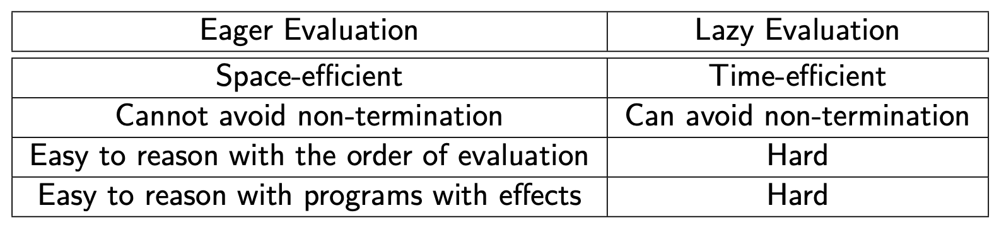

# 느긋한 계산과 즉시 계산

- [느긋한 계산과 즉시 계산](#느긋한-계산과-즉시-계산)
  - [느긋한 계산법 (Lazy Evaluation)](#느긋한-계산법-lazy-evaluation)
  - [조급한 계산법 (Eager Evaluation)](#조급한-계산법-eager-evaluation)
  - [두 계산법의 비교](#두-계산법의-비교)
    - [느긋한 계산법](#느긋한-계산법)
    - [조급한 계산법](#조급한-계산법)

표현식(Expression)을 계산하는 시기에 따라서 `느긋한 계산`과 `즉시 계산`으로 구분할 수 있다.

## 느긋한 계산법 (Lazy Evaluation)

> 느긋한 계산법에서는 파라미터의 계산을 실제로 해당 인자가 필요할 때 계산한다.

지연 계산법이라고도 불리는 느긋한 계산법에서는, 만약 프로시저의 인자로 전달한 표현식이 실제로 프로시저의 body에서 사용되지 않늗나면 영원히 계산되지 않는다.

한가지 예시를 들어보자.

```ocaml
let rec infinite (x) = (infinite x)
in let f = proc (x) (1)
in (f (infinite 0))
```

- `infinite` 프로시저는 `x`를 인자로 받아서 다시 `infinite x`를 호출하는 재귀함수이다. (즉, 호출되는 순간 무한 루프를 돌게 된다.)
- `f` 또한 프로시저로, `x`를 인자로 받아서 `1`을 반환하는 함수이다.
- 마지막 줄에서 `f` 프로시저의 인자로 `infinite 0`을 전달한다.

느긋한 계산법을 사용하는 프로그래밍 언어에서는 예시로 든 위 표현식이 문제 없이 실행되고 종료된다.

왜냐하면 느긋한 계산법에서는 프로시저의 인자가 실제로 필요할 때 계산을 하는데, 따라서 인자로 전달된 무한루프를 발생시키는 `infinite 0`의 값을 계산하지 않으므로 프로그램은 `f`함수의 반환값인 1을 반환하고 종료한다.

## 조급한 계산법 (Eager Evaluation)

> 조급한 계산법에서는 파라미터의 계산을 프로시저의 호출 이전에 계산을 하고 전달한다.

즉시 계산법이라고도 불리는 조급한 계산법에서는, 언제나 파라미터가 프로시저의 호출보다 빠르게 계산된다.

즉 느긋한 계산법에서 들은 에시를 다시 살펴보면,

```ocaml
let rec infinite (x) = (infinite x)
in let f = proc (x) (1)
in (f (infinite 0))
```

위 예시의 `(f (infinite 0))`라는 표현식을 호출하려면 먼저 파라미터로 전달할 `(infinite 0)`표현식의 값을 먼저 계산한다.

그러나 해당 표현식은 실행하는 순간 무한 루프를 발생시키고, 결국 프로그램은 종료되지 않는다. (will be non-termination.)

## 두 계산법의 비교



### 느긋한 계산법

- **Time-efficient**: 필요할 때 파라미터 표현식의 값을 계산하므로 시간을 절약할 수 있다.
- 만약 파라미터가 `non-termination`을 발생한다면, 프로시저의 body에서 해당 파라미터를 사용하지 않는다면 `non-termination`을 피할 수 있다.
- 계산 시기가 정해져 있지 않기 때문에 파라미터나 함수의 호출/계산 순서를 알기 어렵다.
- 프로그램에서 오류가 발생했을 경우 (계산법에 관한)이유를 찾기 어렵다.

### 조급한 계산법

- **Space-efficient**: 파라미터의 값을 먼저 계산하므로, 파라미터로 전달될 표현식과 그 계산을 위한 정보를 따로 저장 할 필요가 없다.
- 만약 파라미터가 `non-termination`을 발생한다면 `non-termination`을 피할 수 없다.
- 계산 시기가 정해져 있기 때문에 파라미터나 함수의 호출/계산 순서를 알기 쉽다.
- 프로그램에서 오류가 발생했을 경우 (계산법에 관한)이유를 찾기 쉽다.

대부분 전통적인 프로그래밍 언어에서는 장단점을 비교하고 보통 조급한 계산법을 사용한다고 한다.

또한 이와 비슷한 느낌으로, `지연 로딩`과 `즉시 로딩`같은 개념도 있는데, 후에 JPA 주제를 다루면서 로딩 방식에 대해 추가로 포스팅 할 예정이다.
