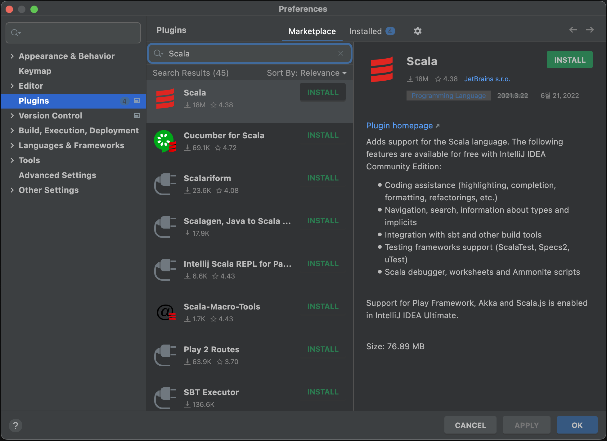
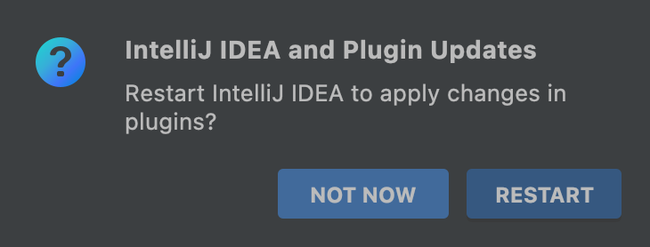
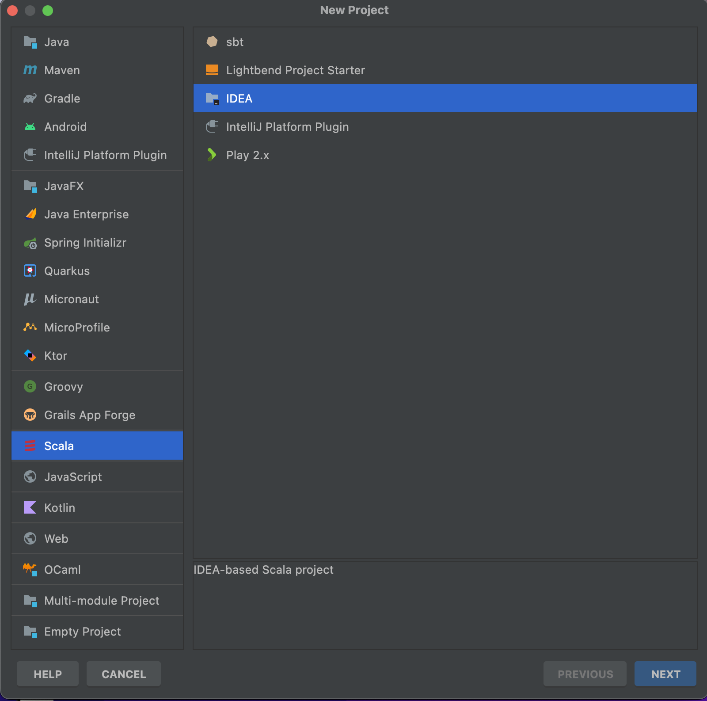
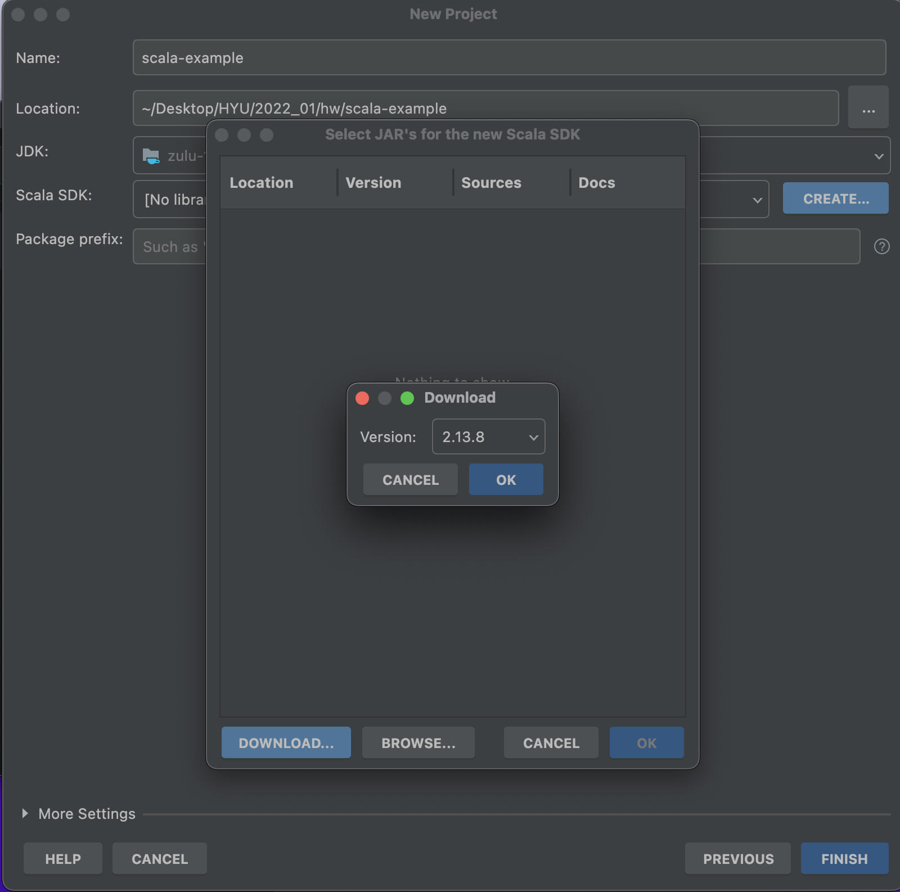
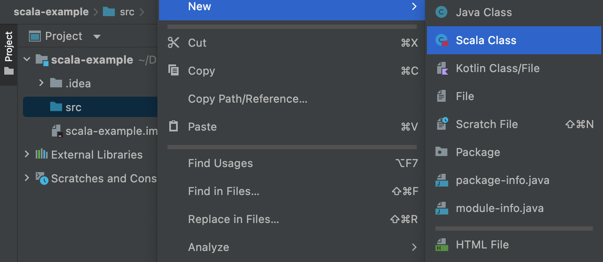
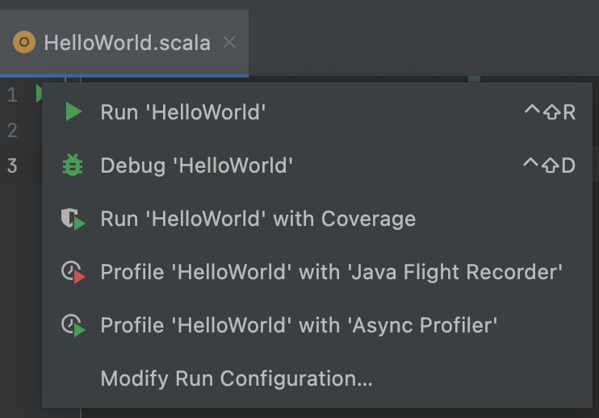

# IntelliJ 스칼라 환경설정 (Mac)

- [IntelliJ 스칼라 환경설정 (Mac)](#intellij-스칼라-환경설정-mac)
  - [설치 과정](#설치-과정)
    - [1. JDK 8+ 설치](#1-jdk-8-설치)
    - [2. IntelliJ Scala 플러그인 설치](#2-intellij-scala-플러그인-설치)
    - [3. Scala 프로젝트 생성](#3-scala-프로젝트-생성)
    - [4. Scala SDK 설치](#4-scala-sdk-설치)
  - [테스트](#테스트)
    - [새로운 클래스 생성](#새로운-클래스-생성)
    - [테스트 코드 작성](#테스트-코드-작성)
    - [실행](#실행)
  - [래퍼런스](#래퍼런스)

## 설치 과정

### 1. JDK 8+ 설치

Java 8 JDK(1.8) 이상 버전을 설치한다.

(참고: https://docs.oracle.com/javase/8/docs/technotes/guides/install/install_overview.html)

### 2. IntelliJ Scala 플러그인 설치

`Preferences - Plugins` 페이지의 검색어에 `Scala`를 입력한 뒤 `INSTALL`버튼을 클릭하여 플러그인을 설치한다.



설치가 완료되면 아래와 같이 IntelliJ에 업데이트를 적용하겠냐는 문구가 뜨게 되며, 재시작을 진행한다.



### 3. Scala 프로젝트 생성

IntelliJ 홈 화면에서 `New Project`를 클릭하면 아래와 같이 좌측 메뉴에 `Scala` 프로젝트를 생성할 수 있도록 인터페이스가 제공된다.



좌측 메뉴에서 `Scala`, 우측 메뉴에서 `IDEA`를 선택한다.

### 4. Scala SDK 설치

3번 과정에서 `Next` 버튼을 클릭한 경우 `Scala SDK` 부분이 `[No library]` 등 문구로 선택되지 않은 상태이다.

`CREATE... - Download... - 최신버전(2.13.8) 선택 - OK` 과정을 따라서 Scala SDK를 설치한다.



## 테스트

### 새로운 클래스 생성

`src 우클릭 - New - Scala Class 선택`



### 테스트 코드 작성

```Scala
object HelloWorld extends App {
  println("Hello, World!": String)
}
```

기존 `class HelloWorld { }` 대신 `object`를 사용했고, 기초적인 `Hello, World!`를 출력하는 코드를 작성했다.

### 실행

코드 안의 초록색 화살표를 클릭하여 `Run 'HelloWorld'`를 클릭하면 실행핧 수 있다.

혹은 좌측의 프로젝트 인터페이스에서 파일을 우클릭하면 동일한 명령을 실행할 수 있다.



## 래퍼런스

https://docs.scala-lang.org/getting-started/intellij-track/getting-started-with-scala-in-intellij.html
