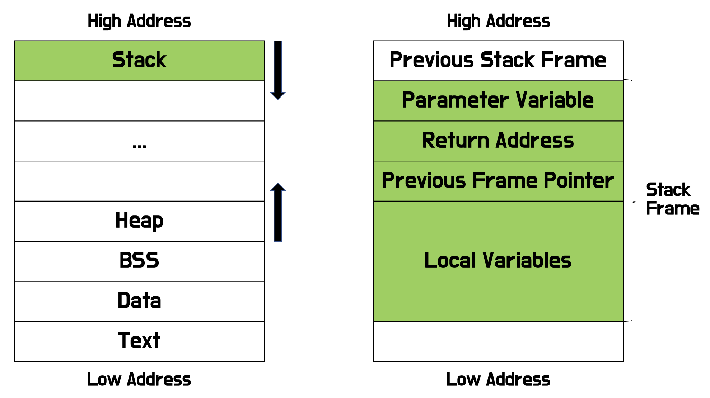
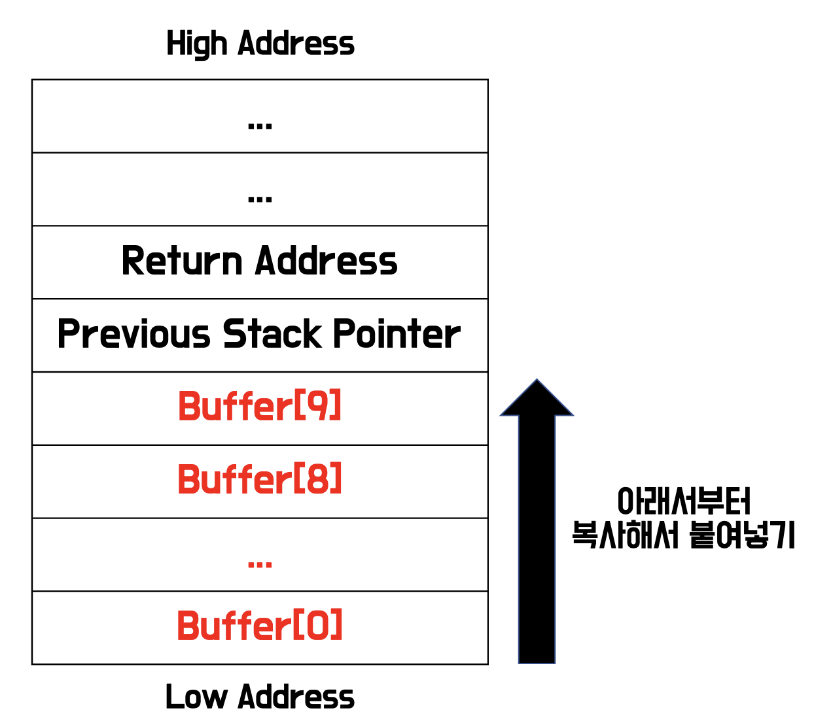
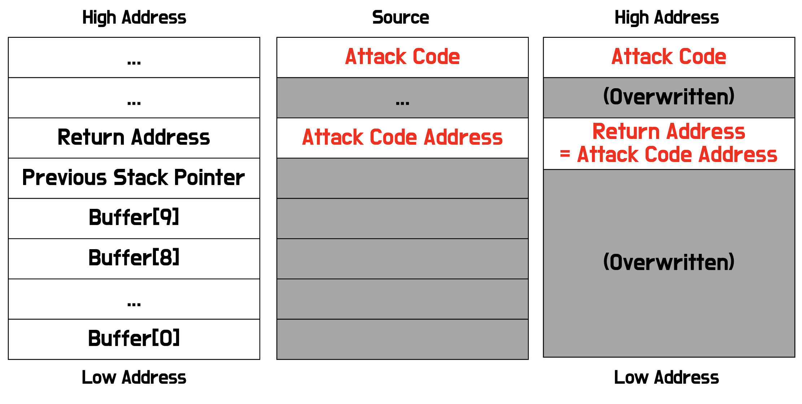

# Buffer Overflow

> 대표적인 시스템 공격 방법 중 하나인 버퍼 오버플로우 공격에 대해서 간단히 알아보자.

## 스택의 구조



공격에 앞서 스택의 구조를 알아야 한다.

시스템의 메모리는 좌측 그림처럼 ```Stack, Heap, BSS, Data, Text``` 등이 그림과 같은 순서로 구성되어 있다. (자세한 내용은 따로 정리를 할 예정이다.)

그 중에서 스택은 우측 그림처럼 구성되어 있다. 아래 예시를 통해 스택의 구조를 알아보자.

```c
void foo(int a, int b) {
    int x;
}
void main() {
    foo(1,2);
    printf("hello world");
}
```

1. `Previous Stack Frame` : main 함수에서 foo 함수를 호출한다. 이때의 `Previous Stack Frame` 는 main 함수의 스택 프레임 부분을 의미한다.

2. `Parameter Variables` : main 함수에서 foo 함수를 호출할 때 1,2 라는 값을 파라미터로 넘겨준다. 이러한 값들이 foo 함수의 스택 프레임의 가장 위에 위치한다.

3. `Return Address` : foo 함수가 종료된 뒤 돌아갈 주소를 나타낸다. main 함수에서 `foo(1,2);` 코드로 foo 함수를 실행시켰고, foo 함수가 종료되면 그 다음 줄인 `printf("hello world");` 가 이어서 실행되어야 한다. 따라서 다음에 실행시킬 주소를 스택 프레임에 저장한다.

4. `Previous Stack Pointer` : foo 함수를 호출하기 이전 스택 포인터 값을 저장한다.

* 스택 포인터 (Stack Pointer) : 스택 자료구조는 Top 부분에서만 입력과 출력이 가능한데, 메모리에서도 항상 마지막(그림에서 가장 아래쪽)에서만 입력과 출력이 가능하다. 따라서 해당 스택 프레임의 마지막을 가리키는 포인터가 스택 포인터이다.

5. `Local Variables` : foo 함수에서 사용하는 지역변수를 나타낸다.

이렇듯 메모리의 스택 영역은 함수가 호출 될 때 마다 위의 스택 프레임 구조로 메모리에 담게 된다.

## strcpy 함수

버퍼 오버플로우를 테스트하기 위해 `strcpy` 함수를 먼저 알아보자.

`strcpy` 함수는 말 그래도 문자열을 복사하는 함수로, 대표적인 오류가 발생할 수 있는 위험한 함수다.

작동 방식은 간단하게, `strcpy(destination, source);` 와 같이 사용하면, destination 주소에 source 의 값들을 복사해서 붙여넣는다.

이때 source 에서 읽으면서 `'\0' (NULL)` 을 만날 때 까지 읽게 된다.



크기가 10인 버퍼가 있다면 위의 그림처럼 메모리에 저장된다. `strcpy` 함수로 다른 문자열에서 버퍼로 값들을 복사해오면 Low Address 에 있는 0번째 인덱스 칸부터 복사를 해 나간다.

이때 source 의 길이가 destination(버퍼) 의 길이보다 길다면 다른 메모리까지 덮어쓰므로 위험한 상황이 발생한다. 이것만 해도 시스템에는 굉장히 치명적일 수 있는 상황이다.

## Buffer Overflow Attack

위의 strcpy 를 사용할 때 길이를 맞추지 않아서 시스템을 공격하는 방법도 시스템에는 치명적이지만, 공격 기법들이 그렇듯이 최종적으로는 Root Shell 을 실행시킬 수 있는 Attack Code 를 실행시키는 것이 목적이다.

버퍼 오버플로우의 아이디어는 스택 프레임의 구조에서 얻을 수 있다. 스택 프레임의 `Return Address` 는 다음에 실행시킬 코드의 주소를 저장한다. 그리고 앞서 살펴본 `strcpy` 함수는 source 문자열의 길이가 더 길 경우 버퍼 이상의 메모리도 덮어쓸 수 있다.

이제 버퍼 오버플로우 공격을 살펴보자.



가장 좌측이 현재 버퍼를 가지고 있는 스택 프레임의 구조이다.

그 다음 중앙의 그림은 버퍼에 `strcpy` 함수를 이용하여 붙여넣을 원본 데이터이다. 스택 프레임과 마찬가지로 원본 데이터도 가장 아래에서부터 복사해서 값을 전달해준다. 즉 `Buffer[0]` 에서부터 값들이 붙여넣어지면, `Return Address` 자리에 공격 코드의 주소를 놓을 수 있고, 그 주소에 맞춰서 공격 코드도 함께 입력한다.

그러면 마지막 그림처럼 원래 스택 프레임에서 함수가 종료되면 돌아갈 `Return Address` 자리에 공격 코드 주소를 덮어쓸 수 있고, 해당 공격 코드까지 함께 입력해서 공격자가 원하는 코드를 실행할 수 있다.

## 주의점

위의 공격은 `Return Address` 자리에 `strcpy` 함수를 이용하여 공격 코드의 주소를 덮어쓰기 하면서 공격이 진행된다. 여기서 다시 알아야 할 `strcpy` 함수의 특징은 `'\0' (NULL)` 값을 만날 때 까지만 복사한다.

즉, 공격 코드의 주소에 하나의 바이트라도 0을 포함한다면 해당 값까지만 복사하고 그 위의 공격 코드는 복사하지 않을 것이다.

이러한 특징때문에 64비트 시스템에서는 위와 다른 공격 형태를 갖춘다. 왜냐하면 64비트 시스템의 스택 주소가 최대 `0x00007fffffffffff` 까지만 허용된다. 즉, 항상 `'\0' (NULL)` 값을 포함하므로 `Return Address` 위치보다 위의(Low Address) 위치에서는 공격 코드를 넣을 수 없다.

이러한 주의점 외에도 공격 코드에 정확히 도달시키기 위해서 Overwrite 하는 부분의 코드를 NOP (No Operation) 으로 채워 넣는 등의 처리도 필요하고, 스택 프레임에서 Return Address 까지의 거리를 구하는 방법도 필요하다.

해당 포스팅에서는 간단하게만 알아봤기 때문에, 더욱 자세히 버퍼 오버플로우 공격을 알고싶다면 다른 잘 정리된 글을 참고하면 좋을 듯 하다.