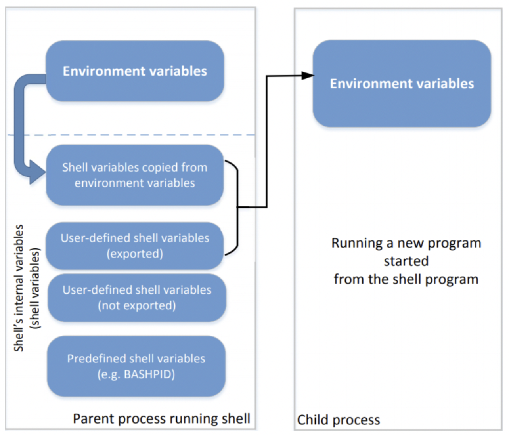
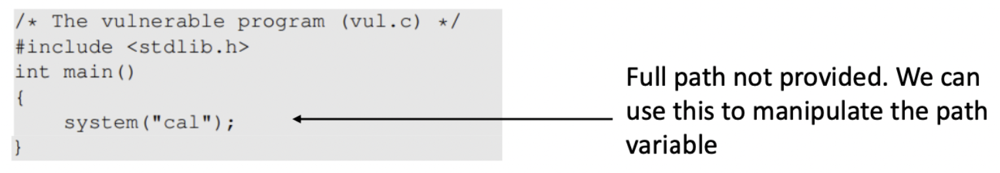

# 환경 변수 공격

- [환경 변수 공격](#환경-변수-공격)
  - [환경 변수와 쉘 변수](#환경-변수와-쉘-변수)
    - [환경 변수 (environment variable)](#환경-변수-environment-variable)
    - [쉘 변수 (shell variable)](#쉘-변수-shell-variable)
  - [Dynamic Linker Attack](#dynamic-linker-attack)
    - [Static Linking](#static-linking)
    - [Dynamic Linking](#dynamic-linking)
    - [Attack](#attack)
    - [Countermeasure](#countermeasure)
  - [External Program Attack](#external-program-attack)
    - [Attack](#attack-1)
    - [Countermeasure](#countermeasure-1)
  - [Library Attack](#library-attack)
    - [Countermeasure](#countermeasure-2)
  - [Application Attack](#application-attack)
    - [Countermeasure](#countermeasure-3)

## 환경 변수와 쉘 변수

### 환경 변수 (environment variable)

- `name-value` 쌍의 집합이다.
- 대표적으로 `PATH` 환경변수 등이 있다.

### 쉘 변수 (shell variable)

- 쉘에서 사용하는 내부(internal) 변수이다.
- 쉘은 쉘변수를 사용할 수 있도록 생성/할당/삭제 등의 명령어를 제공한다.

위 그림은 환경 변수와 쉘 변수의 관계를 보여준다.

1. 먼저 쉘 프로세스가 실행될 때 환경 변수를 받아서 쉘 변수로 가져온다.
2. 쉘 프로세스 내에서 `export`된 쉘 변수가 생성된다.
3. 만약 쉘 프로세스가 다른 프로그램을 실행 할 경우 1번의 쉘 변수와 2번의 쉘 변수를 함께 환경 변수로 전달한다.

> export: 말 그대로 내보내는 것. 쉘 변수를 환경 변수로 내보낼 수 있도록 만든다.

## Dynamic Linker Attack

### Static Linking

컴파일 시 필요한 모든 코드를 함께 컴파일 하는 것을 의미한다.

예를 들어 `#include <stdio.h>`의 `printf()` 함수를 사용하는 코드가 있다면, 컴파일 단계에서 `printf()`가 포함된 `stdio.h`파일을 찾아서 함께 컴파일 한다.

- 따라서 컴파일 된 파일의 용량이 크다.

### Dynamic Linking

Static Linking과 다르게 런타임에서 위와 같은 과정을 처리한다.

즉, 프로그램이 실행되면 그때 `printf()`를 링크하는 과정이 실행된다. 그리고 이렇게 링크할 때 환경 변수가 사용된다.

- 컴파일 된 파일의 용량이 작다.
- 그러나 환경 변수가 사용되므로 위험하다.

> 참고: 컴파일 된 파일에 대해 `ldd` 명령어로 어디에 링크되었는지 알 수 있다.

### Attack

**LD_PRELOAD**: 라이브러리 검색 시 첫번째로 검색할 라이브러리 목록(환경변수)
**LD_LIBRARY_PATH**: LD_PRELOAD에서 찾지 못했을 때 검색할 디렉토리 목록

만약 Set-UID 프로그램을 실행하기 전에 위 두 환경변수를 수정한다면?

우리의 예상대로라면 링크 대상을 공격 프로그램으로 바꿀 수 있을 것으로 예상된다. 그러나,

### Countermeasure

만약 RUID != EUID 일 경우 LD_PRELOAD와 LD_LIBRARY_PATH 환경 변수는 무시된다.

그러면 환경 변수는 안전한 것일까?

## External Program Attack

애플리케이션 내에서 다른 외부 프로그램(External Program)을 실행할 경우를 생각해보자.

위 `system("cal")` 코드는 `cal`이라는 프로그램을 실행시킨다.

그러나 `cal`에 대한 전체 위치가 표시되지 않으므로, 이를 환경 변수인 PATH 에서 검색하게 된다.

### Attack

원래 목표는 캘린더를 출력하는 `/bin/cal` 프로그램을 실행하는 것이 목표였지만, 우리는 `PATH` 환경 변수를 수정함으로써 대상 프로그램을 바꿀 수 있다.

즉, `export PATH=.:$PATH`와 같이 `PATH` 환경변수의 맨 앞에 `.` 디렉토리를 추가하고, 해당 위치에 `cal`이라는 이름의 공격 프로그램을 배치한다. (대부분 공격 프로그램은 루트 쉘을 얻을 수 있는 `/bin/sh`을 실행하는 공격 프로그램이다.)

이 경우 위의 이미지에 나와있는 프로그램을 컴파일한 후 실행하면 공격 프로그램이 실행되게 된다.

### Countermeasure

**공격 표면의 차이**:

- `exec()` family function → program + invoked external program
- `system()` function → program + invoked external program + **shell program** (system함수는 결과적으로 `/bin/sh`를 실행시키고 그 위에서 프로그램을 호출하는 방식이기 때문)

즉 위 공격에서 환경 변수로 전달된 `PATH`가 수정되는 것이 문제가 된다.

왜냐하면 `system()` 함수는 **1. 쉘을 생성**하고 **2. 쉘에서 프로그램을 실행**한다.

1번에서 2번으로 넘어가는 경우 쉘에서 프로그램을 실행하는 형태이므로 프로그램의 환경변수로 쉘 변수를 넘겨준다.

따라서 수정할 수 있는 쉘 변수를 환경 변수로 넘길 수 있으므로 문제가 생긴다.

이를 `execve()`와 같은 `exec()` family function으로 바꾸면 쉘을 실행하지 않으므로 더 안전하다.

## Library Attack

프로그램에서 `system()` 함수 등으로 직접적으로 프로그램을 실행하지 않고, 외부 라이브러리를 사용할 경우 발생할 수 있다.

외부 라이브러리 내에서 특정 환경 변수에 의존적인 경우 그 환경 변수에 대한 공격이 가능하다.

### Countermeasure

- 특정 조건일 경우 어떤 환경 변수를 무시하는 등 라이브러리 작성자가 잘 구현하는 방법이 있다.

## Application Attack

사용자 애플리케이션에서 직접 `getenv()` 함수 등으로 환경 변수를 가져와서 사용하는 경우 발생할 수 있다.

### Countermeasure

`secure_getenv()`를 사용한다.

이 함수는 `getenv()`와 같은 기능을 하지만, 만약 EUID != RUID 일 경우 NULL을 리턴한다.
