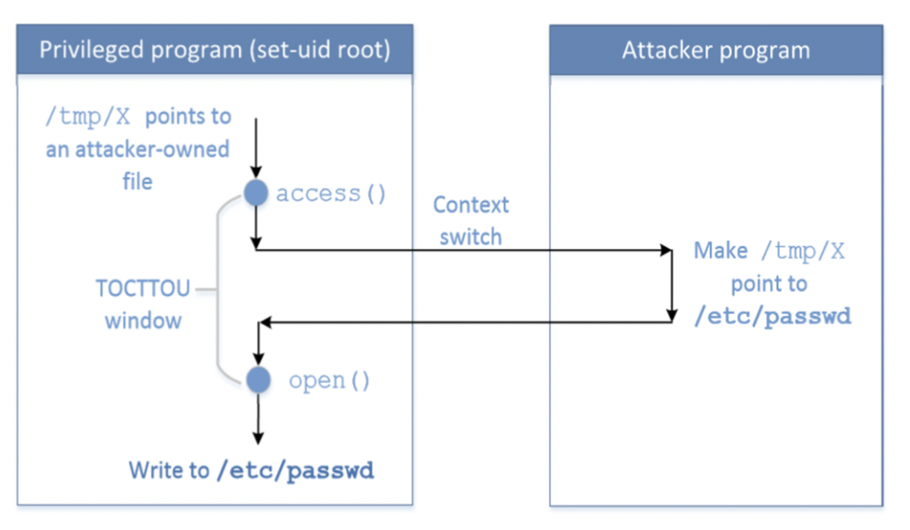

# Race Condition Vulnerability

## Race Condition

Race Condition이라는 단어는 운영체제를 공부했다면 한번쯤은 들어보았을 용어이다.

여러개의 프로세스(혹은 스레드)가 하나의 공유 자원을 두고 함께 돌아가면서 사용할 때, CPU가 스케줄링을 통해 실행 순서를 결정하게 된다.

Race Condition은 CPU가 설정한 실행 순서에 따라 결과가 다르게 나오는 것을 의미한다.

일반적으로 좋은 쪽으로의 결과 변화보다는 나쁜 쪽으로의 결과 변화를 의미한다.

## Race Condition Attacak

만약 어떤 프로그램이 접근하는 자원의 임시 파일을 알아낼 수 있다면 Race Condition 공격을 시도할 수 있다.

### 방법

Set-UID가 적용된 정상 프로그램을 A, 공격 프로그램을 B, 접근하려는 파일을 F라고 하면,

1. 파일 F를 일반 유저가 접근할 수 있도록 설정한다.
2. 프로그램 A에서 파일 F에 대한 접근을 허가받는다.
3. 프로그램 B에서 파일 F를 심볼릭 링크(Symbolic Link)를 공격 대상 파일(`/etc/passwd` 등)로 설정한다.
4. 프로그램 A에서 파일 F를 연다.
5. 프로그램 A에서 파일 F를 수정한다. (F가 심볼릭 링크로 공격 대상 파일에 연결되었으므로 공격 대상 파일을 수정할 수 있다.)

> **TOCTTOU** : Time-Of-Check To Time-Of-Use, 유효성을 검사하고, 리소스를 사용하기까지의 사이 시간을 의미한다. 이 시간에 공격이 이루어질 수 있다.

## Countermeasure

1. **Atomic Operation**: `f = open(file, O_CREAT | O_EXCL)` 와 같이 유효성 검사와 사용을 동시에 진행한다. (즉 TOCTTOU를 제공하지 않는다.)
2. **반복적인 유효성 검사**: 유효성 검사를 반복적으로 진행한다. 이 경우 TOCTTOU가 존재하지만, 반복적으로 검사하므로 공격 성공률이 굉장히 낮아진다.
3. **Sticky symlink protection**: 파일을 열 수 있는(`fopen()` 함수의 대상) 대상을 제한한다.
   - 파일의 소유자가 Follower(EUID)와 같거나
   - 파일의 소유자가 해당 디렉토리의 소유자와 같은 경우 열 수 있다.
4. **최소 권한 원칙**: 항상 EUID를 사용하지 않고, 권한이 필요한 경우에만 권한을 사용할 수 있도록 조정한다.
